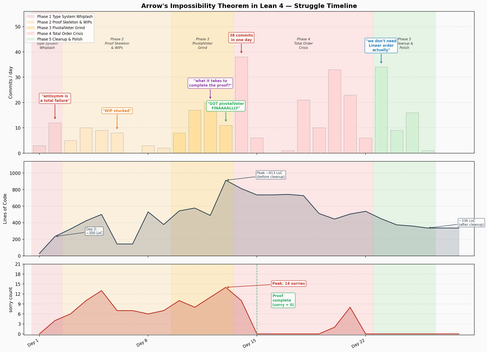

# Why Lean?


- The **Threat**: AI find exploit fast
  - AIs like Mythos can find bugs really fast.
  - TODO: Attack /Defence asymmetry tilting.
- The **Opportunity**: Formal method used to be costly
  - AI now makes it cheap
- The **Need**: Automate coding beyond human reasoning
  - People might want to work with 20 agents, but still want some guarantees -- Interactive Theorem Proving helps. People call it [vericoding](https://blog.icme.io/vericoding-the-end-of-trust-me-bro-the-ai-wrote-it/) [code](https://github.com/Beneficial-AI-Foundation/vericoding-benchmark) [paper](https://arxiv.org/abs/2509.22908)
  - The [Lean Atlas](https://arxiv.org/abs/2604.16347) paper argues that if we can trust Lean's type checking and Mathlib, 95%~99% of the proofs need no human review (depending on whether the codebase is definition-heavy or proof-heavy). Naively this translates to a 20x~100x improvement in review efficiency. [code](https://github.com/NyxFoundation/lean-atlas) [demo](https://lean-atlas.nyx.foundation/demo)

## My experience

- [Lean Natural Number Game](https://adam.math.hhu.de/#/g/leanprover-community/NNG4) is a good place to start. It's a fun game to play. Lean is like a chess game. You have a game board with a goal, and then you slowly apply theorems in your toolbox, to move the shape of statements to the final goal.
- [Arrow's Impossibility Theorem](https://github.com/ChihChengLiang/arrow/blob/main/Arrow/Arrow.lean) is my attempt to verify a real world math paper. I chose a paper with just one page proof. But it takes me painful 2~3 weeks to carry the proof to the final form.
  - There was a struggle to convert between `Fin N` and `Fin (N+1)`, which is the **Intensional equality** issue mentioned below.




##  UX Issues in Proving Assistants

### Lean 4 / Mathlib

- **Universe polymorphism** forces users to occasionally annotate or reconcile universe levels, which is conceptually heavy for newcomers
- **Intensional equality** means `T(N+1)` and `T(1+N)` are distinct types, requiring manual coercions or rewrites in places that feel obviously trivial
- Error messages can be cryptic when type unification fails — the system often reports the symptom deep in elaboration rather than the actual source of the mismatch
- Classical logic (`Classical.em`) is assumed silently by Mathlib, meaning non-constructive proofs like the **√2 irrationality case** work out of the box with no ceremony — a deliberate, pragmatic choice that smooths everyday proof writing

In the following code snippet, we show a non-constructive proof. We show that a irrational power of a irrational could be a rational number. However, we never tell you whether √2 ^ √2 is rational or not in this proof. "by_cases" here uses the `p ∨ ¬p` [Law of exclusion of middle](https://github.com/leanprover/lean4/blob/48ad8401cd5624c944890893a38057ae4920e8ef/src/Init/Classical.lean#L35C1-L36C34).

You can run the code [here](https://live.lean-lang.org/)

```lean
import Mathlib

theorem irrational_pow_irrational_rational :
    ∃ (a b : ℝ), Irrational a ∧ Irrational b ∧ ¬ Irrational (a ^ b) := by
  by_cases h : Irrational (√2 ^ √2)
  · -- Case: √2 ^ √2 is irrational → use it as base
    refine ⟨√2 ^ √2, √2, h, irrational_sqrt_two, ?_⟩
    show ¬Irrational ((√2 ^ √2) ^ √2)
    rw[
      ← Real.rpow_mul (Real.sqrt_nonneg 2),
      Real.mul_self_sqrt (Nat.ofNat_nonneg 2),
      Real.rpow_ofNat,
      Real.sq_sqrt (Nat.ofNat_nonneg 2)
    ]
    exact not_irrational_ofNat 2
  · -- Case: √2 ^ √2 is rational → we're already done
    exact ⟨√2, √2, irrational_sqrt_two, irrational_sqrt_two, h⟩
```

### Rocq/Coq

The same proof is much longer in Rocq.

- Classical excluded middle requires an explicit `Require Import Classical`, breaking proof flow when doing everyday mathematics; in the √2 case, this is just one line, but the cultural expectation of constructivity historically discouraged it.
- Sparse standard library means even basic facts — such as the irrationality of √2 — are `Admitted` or must be proved from scratch, not because Rocq is incapable, but due to lack of community library investment compared to Mathlib.

High level things aside, Lean 4's devEx is much better than Rocq. Lean 4 is very easy to install with VSCode extensions. And here are some issues I encountered when setting up Rocq.

- **Goals panel shows "Not in proof mode"** — unlike Lean 4's always-live InfoView, the vsrocq plugin requires the cursor to be inside a Proof./Qed. block, and in manual mode (proof.mode: 0) you must advance the proof tip with Alt+↓. Setting vsrocq.proof.mode: 1 gives continuous checking closer to Lean's behavior.

- **VSCode extension can't find the language server** — vsrocq.path must point to the vsrocqtop binary explicitly; the extension does not search the OPAM environment automatically since VSCode launches outside of it.

- **Two conflicting Rocq installations (Homebrew + OPAM)** — make picked up the wrong binary, causing mismatched library paths. Rocq does not have a single canonical package manager like Lean's elan/lake.

- **Standard library is a separate OPAM package (rocq-stdlib)** — not bundled with the core install. From Stdlib Require Export String fails silently until rocq-stdlib is installed explicitly. In Lean 4, Std is managed automatically via lake.

- **Makefile.coq / Makefile.coq.conf build system** — Software Foundations uses a generated Makefile (rocq makefile) rather than a declarative build manifest like lakefile.lean. The generated files must be kept in sync with the active Rocq binary.

## Cryptography

We're seeing a trend that people move on beyond pens, papers, Latex, and human review, then craft machine verifiable math proofs.

I'm not sure if this is already helpful in software implementation side. AI says yes, but I'm now incompetent to verify the claim thus I'm skeptical. 

### VCV-io: Library for Cryptography Security Proofs

- **Repo**: [`VCV-io`](https://github.com/Verified-zkEVM/VCV-io) — Lean 4 framework for formally verified cryptographic proofs, built on Mathlib
- **Organization**: Academic / open collaboration; primary authors Devon Tuma and Quang Dao, with contributions from Alexander Hicks, Pietro Monticone, Gabe Robison, Bolton Bailey, and others
- **Language**: Lean 4, with Mathlib as the mathematical foundation; C FFI for differential testing against native ML-DSA/ML-KEM/Falcon backends
- **Timeline**: March 2024 – present (~26 months); development accelerated sharply in early 2026 (113 commits in April 2026 alone)
- **Goal**: Machine-checked security proofs for cryptographic schemes — IND-CPA, EUF-CMA, perfect secrecy, UC emulation, forking lemmas, Fiat-Shamir transforms — quantified over *all* adversaries, not just sampled inputs
- **Scale**: 491 Lean files, ~155,000 lines of Lean; 308 commits; 10+ contributors
- **License**: Apache 2.0

## Where Software Engineering is Going?

These are reflections after reading the case studies in the next section.

Traditional programming languages are optimized for humans — English-speaking humans especially. But now that agents provide cheap and capable coding skills, the organization is changing. From the point of view of Rich Sutton's "The Bitter Lesson," we should do things that favor agent productivity.

The way we channel our intents to implementation is changing. Originally we tried to speak English in a way logical enough that raw machines could understand and turn it into low-level data/compute operations.

Now, since implementations will grow beyond human reasoning, we speak the language of math to solidify our intents. Smart machines write opcodes directly to skip "compilation," and that favors math.

It also seems the software input/output bug is solved — or must be solved — due to external threats. People now move a level up. We model the attackers and their mental state. This level of modeling used to belong to the academic world and paper writing. But the trend looks like it can cover implementation.

### Where Will Vulnerabilities Go?

The arms race dynamic of formal verification doesn't eliminate vulnerabilities — it relocates them. Each layer you formally verify pushes the attack surface to the boundary above or below it. The `clean` verification table is the canonical illustration: the constraint system is proven correct, but the serialization to the prover is unverified. The adversary simply targets the seam. This is close to a conservation law: verification hardens one layer, and the boundary becomes the most attractive target.

Concretely, the seams that remain:

- **Spec-to-intent gap.** Formal verification proves your implementation matches your spec — not that your spec matches your intent. A subtly wrong spec is invisible to the type checker. The Circom `IsZero` missing-constraint bug would have failed to compile in `clean`, but only because the spec was written to catch it. This gap lives in human cognition, not in any tool.
- **Trusted computing base.** Lean's kernel, Mathlib, the RISC-V semantics model — these are the axioms everything rests on. The lean-zip fuzzing campaign illustrates the irony: 105 million executions found no memory vulnerabilities in the verified library, but found a bug in Lean 4's own runtime.
- **Composition boundaries.** Individual components get verified; emergent behaviors from composition are harder. Each EVM opcode gets a proof, but reentrancy patterns and cross-contract state arise from opcode sequences. Verifying ADD doesn't verify a flash loan attack.
- **Social and supply chain.** If an agent writes both the spec and the proof, who audits the agent? A subtly manipulated model could write a spec with a deliberate hole — a software supply chain attack, one level up, disguised as a rigorous proof.

## Case studies

### Lean-zip: Formal Verification of a Compression Library in Lean 4

#### Background

- **Repo**: [`kim-em/lean-zip`](https://github.com/kim-em/lean-zip) — a Lean 4 library for zlib, gzip, DEFLATE, and ZIP archive formats
- **Author**: Kim Morrison, core developer at the Lean Focused Research Organization (FRO)
- **AI co-contributor**: Claude Code is listed as a GitHub contributor; ~660 AI-assisted sessions produced ~653 merged PRs
- **Timeline**: February 19 – April 22, 2026 (roughly two months)
- **Goal**: Not just a working library — a fully *proved-correct* one, with zero unfinished proof obligations ("sorries") at completion
- **Toolchain**: Lean 4 (v4.29.1), with specs in `Zip/Spec/` (42 files, 20,606 lines) and native code in `Zip/Native/`

#### Highlights

- **Proving costs 6–20× more than writing.** Writing the DEFLATE decompressor took 4 sessions; proving it correct took 25. The compressor and full roundtrip proofs consumed ~80 sessions. The implementation is the easy part.

- **The capstone theorem is a universal guarantee.** [`inflate_deflateRaw`](https://github.com/kim-em/lean-zip/blob/e64e4cf32b603158bc914f6e73aa38ae695ae72d/Zip/Spec/DeflateRoundtrip.lean#L28-L38) states that for *every* input under 1 GiB, compress-then-decompress returns the original data exactly — a claim no test suite can make. The 1 GiB bound is an explicit zip-bomb guard, not a proof limitation; formal verification forces implicit assumptions to become named preconditions.

```lean
/-- Unified DEFLATE roundtrip: inflate ∘ deflateRaw = identity.
    This is the Phase B4 capstone theorem from PLAN.md. Generalized to any
    `maxOutputSize` large enough to hold the input. -/
theorem inflate_deflateRaw (data : ByteArray) (level : UInt8)
    (maxOutputSize : Nat) (hsize : data.size < maxOutputSize) :
    Zip.Native.Inflate.inflate (deflateRaw data level) maxOutputSize = .ok data := by
  unfold deflateRaw
  split
  · exact inflate_deflateStoredPure data _ (by omega)
  · split
    · exact inflate_deflateFixedIter data _ (by omega)
    · split
      · exact inflate_deflateLazyIter data _ hsize
      · exact inflate_deflateDynamic data _ (by omega)
```


- **Proof quality is first-class engineering.** A campaign to eliminate fragile bare `simp` tactics (which silently break as Lean's library evolves) required 30 pull requests to reduce ~129 occurrences to zero. Large proof files were split into focused modules. Reusable lemmas were extracted. The same discipline applied to code applies to proofs.

- **Security fell out as a byproduct.** Specifying what a "valid" ZIP entry *is* automatically enumerates everything it isn't. The project closed dozens of security dimensions — NUL-byte injection, ZIP64 field smuggling, malformed EOCD consistency — and the malformed-fixture test suite grew from 12 to 47 entries as proof work surfaced new edge cases. These are exactly the bugs testing rarely finds.

- **AI handles implementation; humans handle architecture.** The ~1:1 session-to-PR ratio shows a tight loop where each session yielded a mergeable contribution. Claude Code was effective at writing tactics, decomposing theorems, and mapping concepts into Lean's type system. The human expert determined *what* to prove and diagnosed deep failures — a division of labor that may define AI-assisted formal verification going forward.

Claude Code investigation shows:

- **Structural invariants that are untestable.** The Kraft inequality proof (nextCodes_plus_count_le) verifies that the canonical Huffman code assignment never overflows its code space at any bit length — a property about the internal state of a loop over arbitrary frequency distributions. No finite test set can cover all valid distributions.

- **Prefix-freedom for all code tables.** canonical_prefix_free proves that no Huffman codeword is a prefix of another, for every valid length assignment. This property is combinatorially intractable to test exhaustively (all pairs of symbols, across all valid tables).

- **Bridging the imperative/spec gap.** BitstreamCorrect.lean formally proves that the C-style BitReader (byte array + position/offset cursor) tracks the spec-level List Bool bit-by-bit at every step. Tests verify output correctness; the proof verifies that the cursor arithmetic is correct at every intermediate position — the source of the hardest-to-find off-by-one bugs in bit-packing code.

- **Algebraic checksum compositionality.** Both CRC32 and Adler-32 specs prove checksum(xs ++ ys) = f(checksum(xs), ys) for all inputs. Beyond being untestable exhaustively, this identity is what enables larger proofs to compose — the gzip roundtrip theorem reuses it directly rather than re-reasoning about the full byte stream.

- **Proofs compose; tests don't.** The capstone gzip theorem (gzip_decompressSingle_compress) assembles from ~15 sub-theorems across bitstream, Huffman, LZ77, block-framing, and checksum layers. Each layer is independently verified and then reused. In a test suite, the same logic would be re-implemented in the test harness — which is itself unverified.

- **Scale**: 20,606 lines of spec across 42 files, zero sorrys, ~653 merged PRs — the project demonstrates that this level of verification is achievable incrementally over ~660 sessions, not just in academic one-off proofs.

- **Bugs could still be found**: [105 million fuzzing executions](https://kirancodes.me/posts/log-who-watches-the-watchers.html) found:
  - No memory vulnerabilities.
  - A bug in Lean 4's runtime.
  - A denial-of-service in a unverified archive parser.

### Clean: Formal Verification of ZK Circuits

#### Background

- **Repo**: [`Verified-zkEVM/clean`](https://github.com/Verified-zkEVM/clean) — Lean 4 library for writing and formally verifying ZK circuits
- **Organization**: [zkSecurity](https://zksecurity.xyz/), under the Verified-zkEVM grant program
- **Language**: Lean 4, with a Rust backend (Plonky3)
- **Timeline**: July 2024 – present (~22 months of active development, steep ramp-up in 2025)
- **Goal**: Machine-checked proofs for ZK circuit correctness — soundness, completeness, and field wrap-around safety — over *all* possible field elements and adversarial witnesses, not just tested inputs
- **Scale**: 26,404 lines of Lean across 153 files; ~800 commits/month peak in mid-2025, settled at ~200/month

#### Highlights

- **Familiar syntax, proof obligation attached.** You write circuits with `do`-notation — the same structure a Circom developer would recognise. The original Circom source is embedded as a comment alongside the Lean translation, making the correspondence explicit. The difference: you must also supply a machine-checked proof that the constraints do what the comment says.

```lean
-- Circom original (embedded as a comment):
-- inv <-- in!=0 ? 1/in : 0;
-- out <== -in*inv +1;
-- in*out === 0;

def main (input : Expression (F p)) := do
  let inv ← witness fun env =>
    let x := input.eval env
    if x ≠ 0 then x⁻¹ else 0
  let out <== -input * inv + 1
  input * out === 0
  return out

def circuit : FormalCircuit (F p) field field where
  main
  localLength _ := 2

  Spec input output :=
    output = (if input = 0 then 1 else 0)

  soundness := by
    circuit_proof_start
    simp only [id_eq, h_holds]
    split_ifs with h_ifs
    . simp only [h_ifs, zero_mul, neg_zero, zero_add]
    . rw [neg_add_eq_zero]
      have h1 := h_holds.left
      have h2 := h_holds.right
      rw [h1] at h2
      simp only [id_eq, mul_eq_zero] at h2
      cases h2
      case neg.inl hl => contradiction
      case neg.inr hr =>
        rw [neg_add_eq_zero] at hr
        exact hr

  completeness := by
    circuit_proof_start
    cases h_env with
    | intro left right =>
      simp only [left, id_eq, ite_not, mul_ite, mul_zero] at right
      simp only [id_eq, right, left, ite_not, mul_ite, mul_zero, mul_eq_zero, true_and]
      split_ifs <;> aesop

```

> [Comparators.lean#L28–L67](https://github.com/Verified-zkEVM/clean/blob/07d546bb929144d2da3bb88e53a20144238ec4ba/Clean/Circomlib/Comparators.lean#L28-L67)

- **Proof is part of the type.** A `FormalCircuit` bundles the circuit with machine-checked soundness and completeness proofs. You cannot instantiate one without supplying both — the type system rejects incomplete definitions at compile time.

```lean
structure FormalCircuit (F : Type) [Field F] (Input Output : TypeMap) where
  main        : Var Input F → Circuit F (Var Output F)
  Assumptions : Input F → Prop
  Spec        : Input F → Output F → Prop
  soundness   : Soundness F ...
  completeness : Completeness F ...
```

> [Basic.lean#L298–L303](https://github.com/Verified-zkEVM/clean/blob/07d546bb929144d2da3bb88e53a20144238ec4ba/Clean/Circuit/Basic.lean#L298-L303)

- **Universal quantification over adversaries.** The soundness definition quantifies over `∀ env : Environment F` — every possible witness assignment, including adversarial ones. This is a mathematical statement that no cheating prover can satisfy the constraints without satisfying the spec. The Circom `IsZero` bug (missing `in*out === 0`) would make this proof fail to compile, not just fail a test.

```lean
def Soundness ... :=
  ∀ offset : ℕ, ∀ env : Environment F,
  ∀ input_var : Var Input F, ∀ input : Input F, eval env input_var = input →
  Assumptions input →
  ConstraintsHold.Soundness env (circuit.main input_var |>.operations offset) →
  let output := eval env (circuit.output input_var offset)
  Spec input output ∧ ...
```

> [Basic.lean#L259–L271](https://github.com/Verified-zkEVM/clean/blob/07d546bb929144d2da3bb88e53a20144238ec4ba/Clean/Circuit/Basic.lean#L259-L271)

- **Even the simplest Boolean gadget comes with a proof.** `assertBool` — the `x * (x - 1) = 0` constraint every Circom circuit uses — is formally proven equivalent to `x = 0 ∨ x = 1` via a Mathlib lemma. The `NoZeroDivisors` constraint is load-bearing: it is what lets Lean conclude `x = 0 ∨ x - 1 = 0` from a zero product. The type system enforces this assumption is in scope.

```lean
def assertBool : FormalAssertion (F p) field where
  main (x : Expression (F p)) := assertZero (x * (x - 1))
  Spec (x : F p) := IsBool x
  soundness   := by circuit_proof_all [IsBool.iff_mul_sub_one, sub_eq_add_neg]
  completeness := by circuit_proof_all [IsBool.iff_mul_sub_one, sub_eq_add_neg]
```

> [Boolean.lean#L201–L208](https://github.com/Verified-zkEVM/clean/blob/07d546bb929144d2da3bb88e53a20144238ec4ba/Clean/Gadgets/Boolean.lean#L201-L208)

- **Field wrap-around bugs caught at compile time.** `ByteDecomposition` requires `p_large_enough : Fact (p > 2^16 + 2^8)` as a type-level assumption. Without it, `ZMod.val_mul_of_lt` doesn't apply and the proof fails to compile. You cannot accidentally deploy `ByteDecomposition` with a too-small prime — the compiler enforces it. This is the class of bug that looks correct for small test values but wraps silently near `p`.

```lean
have : (2^n * x).val = 2^n * x.val := by
  rw [ZMod.val_mul_of_lt (by linarith), h_mul_x]
```

> [ByteDecomposition.lean#L77](https://github.com/Verified-zkEVM/clean/blob/07d546bb929144d2da3bb88e53a20144238ec4ba/Clean/Gadgets/ByteDecomposition/ByteDecomposition.lean#L77)

- **Verified composition: proven once, trusted everywhere.** Once a subcircuit is formally verified, it is a trusted black box. `IsEqual` calls `IsZero` as a subcircuit; its soundness proof invokes `IsZero`'s proven spec without re-examining internals. In Circom, reusing a component still requires re-auditing it in every new context. Here, the proof already covers all cases.

```lean
def main (input : Expression (F p) × Expression (F p)) := do
  let diff := input.1 - input.2
  let out ← IsZero.circuit diff    -- treated as a verified black box
  return out

soundness := by
  circuit_proof_start [IsZero.circuit]
  rw [← h_input]
  ...
```

> [Comparators.lean#L83–L109](https://github.com/Verified-zkEVM/clean/blob/07d546bb929144d2da3bb88e53a20144238ec4ba/Clean/Circomlib/Comparators.lean#L83-L109)

- **The trusted gap at the backend.** The formal proofs cover the abstract constraint system inside Lean. Getting those constraints into an actual prover requires JSON serialization (witness generators are silently dropped: `| .witness m _ => ...` — [Json.lean#L49–L54](https://github.com/Verified-zkEVM/clean/blob/07d546bb929144d2da3bb88e53a20144238ec4ba/Clean/Circuit/Json.lean#L49-L54)) and a Rust re-interpretation layer — both unverified. The proofs guarantee the polynomial constraint system is correct; they do not guarantee the bitstring submitted to the verifier is the same system.

| Layer | Verified? |
|---|---|
| Lean kernel (type checker) | Yes |
| `FormalCircuit.soundness / completeness` | Yes |
| `toJson` serialization | **No** |
| Rust backend AST interpretation | **No** |
| Plonky3 proof system soundness | **No** |

- **Proof automation is still growing.** The `circuit_proof_start` tactic handles routine setup, but complex gadgets like `LessThan` still require substantial manual case analysis navigating variable offset arithmetic (`env.get (i₀ + n + 1)`). Proof automation improvements are listed as ongoing work in the roadmap.

### evm-asm: Formally Verified EVM as RISC-V Assembly

#### Background

- **Repo**: [`Verified-zkEVM/evm-asm`](https://github.com/Verified-zkEVM/evm-asm) — Lean 4 verified macro assembler implementing the Ethereum EVM as RV64IM RISC-V assembly
- **Organization**: [zkSecurity](https://zksecurity.xyz/), Verified-zkEVM grant program. Principal author: Yoichi Hirai (~96% of commits)
- **Language**: Lean 4; target runtime is RV64IM RISC-V (the SP1 zkVM substrate)
- **Timeline**: February 2026 – present; ~4,550 commits in May 2026 alone, consistent with "200–600 commits per day" driven by AI agents
- **Goal**: Machine-checked proofs that a RISC-V assembly program correctly implements the Ethereum state transition function, for use as a formally verified zkEVM guest
- **Scale**: 9,904 Lean files, ~1.8M lines; 52+ EVM opcodes proved; 66 conformance vectors passing as theorems

#### Highlights

- **Why verify at the assembly level?** Every language, compiler, and optimizer eventually produces machine instructions. Verifying there sidesteps all higher-level problems: C/C++ undefined behavior, Rust's lack of a stable spec, and the 10–20% overhead of formally verified compilers like CompCert. RISC-V has no undefined behavior — every instruction has a total, formal semantics. In a zkVM context this bites even harder: if the guest program has a bug, the resulting SNARK proof is still valid. It just proves the wrong thing. Formal verification of the guest is the only defense.

- **A three-level proof pyramid for every opcode.** Each of the 52+ opcodes is verified bottom-up. The 256-bit ADD illustrates the structure: Level 1 proves each 5-instruction limb group manipulates the right register and memory cell. Level 2 composes four limb proofs into a full 30-instruction carry-chain spec. Level 3 rewrites the raw limb postcondition into `evmWordIs (sp + 32) (a + b)` — abstract EVM semantics visible to callers.

```lean
theorem evm_add_stack_spec_within (sp base : Word) (a b : EvmWord) ... :
    cpsTripleWithin 30 base (base + 120) (evm_add_code base)
      ((.x12 ↦ᵣ sp) ** ... ** evmWordIs sp a ** evmWordIs (sp + 32) b)
      ((.x12 ↦ᵣ (sp + 32)) ** ... ** evmWordIs sp a ** evmWordIs (sp + 32) (a + b))
```

> [Add/Spec.lean#L74–L128](https://github.com/Verified-zkEVM/evm-asm/blob/b8db01c08fae9bff881e706abc3ef6022f4c3fc1/EvmAsm/Evm64/Add/Spec.lean#L74-L128)

- **The frame rule is baked into the triple definition.** In textbook separation logic the frame rule is a separate inference step. Here `cpsTripleWithin` quantifies over an arbitrary frame `R` internally — every spec says only what the code touches, and unchanged heap, registers, and code are automatically preserved. Each instruction is stated and proved once; callers never re-prove frame conditions.

```lean
def cpsTripleWithin (nSteps : Nat) (entry exit_ : Word) (cr : CodeReq)
    (P Q : Assertion) : Prop :=
  ∀ (R : Assertion), R.pcFree → ∀ s, cr.SatisfiedBy s →
    (P ** R).holdsFor s → s.pc = entry →
    ∃ k, k ≤ nSteps ∧ ∃ s', stepN k s = some s' ∧
      s'.pc = exit_ ∧ (Q ** R).holdsFor s'
```

> [Rv64/CPSSpec.lean#L45–L48](https://github.com/Verified-zkEVM/evm-asm/blob/b8db01c08fae9bff881e706abc3ef6022f4c3fc1/EvmAsm/Rv64/CPSSpec.lean#L45-L48)

- **Proof as a compiler — the AI co-routine.** AI agents write both the assembly subroutine and its Lean proof in the same session. If the proof fails to type-check, the agent knows the code or the spec is wrong — before any test is run, before any deployment. The proof failure is the bug report. This co-routine property is what makes 200–600 commits per day plausible: the type checker replaces the entire test-and-fix loop.

- **What this means for Ethereum clients.**

| Dimension | geth / reth / besu | evm-asm |
|---|---|---|
| Correctness evidence | Passes ethereum/tests vectors | Machine-checked proof for all inputs |
| Spec | EIPs + Yellow Paper (informal) | Lean types + `cpsTripleWithin` + pure EL spec |
| Coverage | Test-driven (finite vectors) | Universal (∀ register values, ∀ memory layouts) |
| Trust base | Rust compiler + std | Lean kernel + Sail RISC-V model |

- **Caveats.** The DIV/MOD semantic bridge is still in progress — Knuth's Theorem B (trial quotient overestimates by ≤ 1) is the remaining blocker. 27 files use `native_decide` against AGENTS.md policy, mostly in RLP round-trip tests over finite concrete values. And the PLAN.md is significantly behind the code: phases listed as future work (interpreter, gas, world state, transactions) already exist in `Evm64/` and `EL/`.

