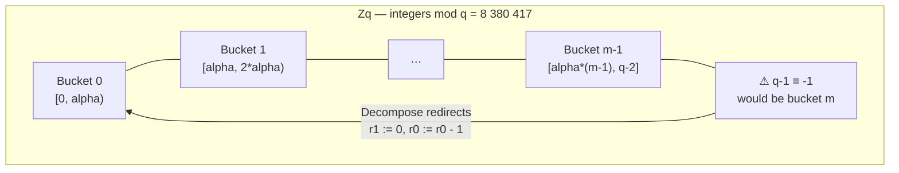
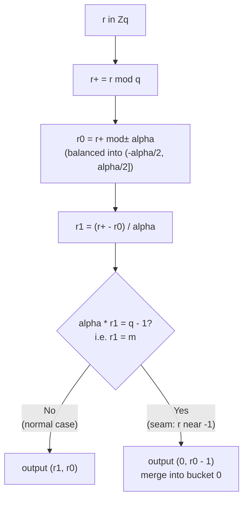

# ML-DSA Concrete Rounding

This is AI generated note to help my [contribution](https://github.com/Verified-zkEVM/VCV-io/pull/405) to [VCV-io](https://github.com/Verified-zkEVM/VCV-io/) project.

`LatticeCrypto/MLDSA/Concrete/Rounding.lean` provides executable, formally verified
implementations of FIPS 204 [@nistFIPS2042024] Algorithms 35–40 — the six coefficient-wise rounding
primitives that ML-DSA uses to compress keys, create signer hints, and verify signatures.

## Why rounding exists in ML-DSA

ML-DSA is a Fiat–Shamir-with-aborts signature scheme.  During signing, the signer
commits to $\mathbf{w} = \mathbf{A}\mathbf{y}$ and sends the high-order part
$\mathbf{w}_1 = \text{HighBits}(\mathbf{w})$ to derive the challenge hash.
During verification, the verifier reconstructs an approximation

$$\mathbf{w}'_{\text{Approx}} = \mathbf{A}\mathbf{z} - c \cdot \mathbf{t}_1 \cdot 2^d$$

and uses the hint $\mathbf{h}$ from the signature to recover $\mathbf{w}_1$ from
that approximation, then checks that the commitment hash matches.
The rounding primitives make this work:

| Role | Primitive | Where used |
|------|-----------|------------|
| Key compression | `Power2Round` | Drop the $d$ least-significant bits of $\mathbf{t}$ to produce the public-key component $\mathbf{t}_1$ |
| Signing commitment | `HighBits` / `LowBits` | Compute $\mathbf{w}_1$ from $\mathbf{w} = \mathbf{A}\mathbf{y}$; keep $\mathbf{r}_0 = \text{LowBits}(\mathbf{w})$ for the validity check |
| Hint creation | `MakeHint` | Record whether adding $-c\mathbf{s}_2 + c\mathbf{t}_0$ to $\mathbf{w} - c\mathbf{s}_2$ changes the high bits |
| Hint use | `UseHint` | Recover $\mathbf{w}\_1$ from $\mathbf{w}'_{\text{Approx}}$ during verification |

## FIPS 204 algorithms covered

| Algorithm | FIPS 204 ref | Lean name (coefficient) | Lean name (polynomial) |
|-----------|-------------|------------------------|----------------------|
| Power2Round | Algorithm 35 | `power2RoundCoeff` | `power2RoundHigh` / `power2RoundLow` |
| Decompose   | Algorithm 36 | `decomposeCoeff`   | — (used internally) |
| HighBits    | Algorithm 37 | `highBitsCoeff`    | `highBits` |
| LowBits     | Algorithm 38 | `lowBitsCoeff`     | `lowBits` |
| MakeHint    | Algorithm 39 | `makeHintCoeff`    | `makeHint` |
| UseHint     | Algorithm 40 | `useHintCoeff`     | `useHint` |

### Power2Round (Alg 35)

Splits $r \in \mathbb{Z}_q$ into a high part $r_1$ and a balanced low part $r_0$ satisfying

$$r \equiv r_1 \cdot 2^d + r_0 \pmod{q}, \qquad |r_0| \leq 2^{d-1}$$

where $d$ = `droppedBits` = 13 in ML-DSA.  The Lean implementation uses standard
integer division with a sign-balancing step (the `≤ power2Scale / 2` branch).

### Decompose (Alg 36)

Like `Power2Round`, but splits with respect to $\alpha = 2\gamma_2$ instead of $2^d$:

$$r \equiv r_1 \cdot \alpha + r_0 \pmod{q}, \qquad |r_0| \leq \gamma_2$$

There is one special case: when the straightforward quotient would give
$r_1 = (q-1)/\alpha$, the standard decomposition would place $r$ very close to
$q - 1 \equiv -1$ and make the high bits unstable under small perturbations.
`Decompose` redirects that case to $(r_1 = 0,\; r_0 - 1)$, ensuring the high
bits change predictably when hints are applied.  This is the `if alpha * r1 = modulus - 1`
branch in `decomposeCoeff`.

### HighBits / LowBits (Algs 37–38)

Thin projections of `Decompose`: $\text{HighBits}(r) = r_1$ and $\text{LowBits}(r) = r_0$.

### MakeHint (Alg 39)

$$\text{MakeHint}(z, r) = \bigl[\text{HighBits}(r) \neq \text{HighBits}(r + z)\bigr]$$

A single Boolean indicating whether adding $z$ to $r$ crosses a rounding boundary.

### UseHint (Alg 40)

Given hint $h$ and $r$, returns the high bits of $r + z$ without knowing $z$
directly, by adjusting $r_1$ up or down by 1 modulo $m = (q-1)/\alpha$ according
to the sign of $r_0$.

## The wrap-around: why $\alpha \cdot m = q - 1$ matters

For all approved ML-DSA parameter sets, the prime modulus $q = 8\,380\,417$ and
stride $\alpha = 2\gamma_2$ satisfy $\alpha \cdot m = q - 1$ exactly,
where $m = (q-1)/\alpha$:

| Parameter set | $\gamma_2$ | $\alpha$ | $m$ | $\alpha \times m$ |
|---------------|-----------|---------|-----|-------------------|
| ML-DSA-44     | 95 232    | 190 464 | 44  | 8 380 416 = $q-1$ |
| ML-DSA-65/87  | 261 888   | 523 776 | 16  | 8 380 416 = $q-1$ |

This means $q = \alpha m + 1$, so $\alpha$ tiles $\{0, \ldots, q-2\}$ into
exactly $m$ buckets of width $\alpha$, with $q - 1$ left over as a single
isolated point.

### Bucket layout



The value $q - 1 \equiv -1$ in $\mathbb{Z}_q$ is adjacent to $0$ with distance 1,
not $\alpha$.  If bucket $m$ were allowed, small perturbations near $q - 1$ could
cause $r_1$ to jump between $0$ and $m$ — a change of $m - 1$ — which
`UseHint`'s $\pm 1 \bmod m$ correction cannot recover.  By redirecting to bucket 0,
`Decompose` ensures the seam sits at a single, well-known point and high bits change
by at most 1 across every rounding boundary.

### Decompose decision flowchart



### Consequences in the Lean proofs

In `Rq` (coefficients live in $\mathbb{Z}_q$), the identity $\alpha \cdot m = q - 1$
becomes $(\alpha : \text{Coeff}) \cdot m = -1$, captured by the local lemma `hwrap`
inside `decomposeCoeff_eq`.  The related `alpha_mul_pred_m_eq` lemma then gives

$$(\alpha : \text{Coeff}) \cdot (m - 1) = -1 - \alpha$$

which is needed in every overflow branch of the UseHint correctness proof.
The `BalancedDecomp` structure codifies both the divisibility
(`hqm1 : alpha * m = modulus - 1`) and the ring-unit consequence
(`hunit : IsUnit (alpha : Coeff)`), so no proof that works from
`ctx : BalancedDecomp` ever needs to re-derive these facts.

## Representation choices

**`High = Power2High = Rq`.**  The FIPS spec treats high-order representatives
as plain integers.  This file keeps them in **Rq** — the negacyclic polynomial ring
$\mathbb{Z}_q[X]/(X^{256}+1)$ — so that the verifier equation
$\mathbf{A}\mathbf{z} - c \cdot \mathbf{t}_1 \cdot 2^d$ stays in a single ring
without any cast overhead.  The `Coeff` cast to/from `ℕ` and `ℤ` appears frequently
in lemma statements.

**`Hint = Vector Bool ringDegree`.**  One `Bool` per coefficient, matching Algorithm 39's
definition exactly.

## The `BalancedDecomp` abstraction

Most non-trivial lemmas in the file are proved in terms of a private structure
`BalancedDecomp (alpha m : ℕ)` that bundles the arithmetic properties needed about
the modulus, stride, and number of buckets:

```lean
private structure BalancedDecomp (alpha m : ℕ) : Prop where
  hα     : 0 < alpha
  h2α    : 2 * (alpha / 2) = alpha   -- alpha is even
  hqm1   : alpha * m = modulus - 1   -- alpha divides q − 1
  hunit  : IsUnit (alpha : Coeff)    -- alpha is invertible mod q
  ...
```

The constructor `BalancedDecomp.ofApproved` discharges all obligations for the
three approved ML-DSA parameter sets (ml-dsa-44, ml-dsa-65, ml-dsa-87) with
`decide`, keeping proof obligations entirely out of the caller lemmas.

This pattern means every theorem stated over `ctx : BalancedDecomp alpha m`
works for any future parameter set satisfying the conditions, not just the three
currently approved ones.

## Theorems proved

### Decomposition identities

```lean
theorem concretePower2Round_high_low_decomp :
    power2RoundShift (power2RoundHigh r) + power2RoundLow r = r

theorem concreteRounding_high_low_decomp (p : Params) :
    highBitsShift p (highBits p r) + lowBits p r = r
```

The split is lossless: $\text{high} \times \text{stride} + \text{low}$ exactly
reconstructs the original polynomial.  Proofs reduce to `natCast_div_add_mod`
on each coefficient.

### Norm bounds on the low part

```lean
theorem concretePower2Round_bound :
    cInfNorm (r − power2RoundShift (power2RoundHigh r)) ≤ 2^(droppedBits − 1)

theorem concreteRounding_lowBits_bound (p) (hp : p.isApproved) :
    cInfNorm (lowBits p r) ≤ p.gamma2
```

In mathematical terms: $\|\mathbf{r}_0\|_\infty \leq \gamma_2$ for the Decompose
low part, and $\|\mathbf{r}_0\|_\infty \leq 2^{d-1}$ for Power2Round.
These establish the smallness property used in the rejection-sampling validity check.

### Stability of HighBits under small perturbations

```lean
theorem concreteRounding_hide_low_of_isApproved (p) (hp) (r s : Rq) (b : ℕ) :
    cInfNorm s ≤ b →
    cInfNorm (lowBits p r) + b < p.gamma2 →
    highBits p (r + s) = highBits p r
```

If $\|\mathbf{s}\|\_\infty \leq b$ and $\|\text{LowBits}(\mathbf{r})\|_\infty + b < \gamma_2$,
then $\text{HighBits}(\mathbf{r} + \mathbf{s}) = \text{HighBits}(\mathbf{r})$.
Adding $\mathbf{s}$ does not push $r_0$ past any rounding boundary, so the high
bits are unchanged.  This is the property that lets the verifier reconstruct
$\mathbf{w}_1$ faithfully.

### Hint correctness

```lean
theorem concreteRounding_useHint_correct_of_isApproved (p) (hp) (z r : Rq) :
    cInfNorm z ≤ p.gamma2 →
    useHint p (makeHint p z r) r = highBits p (r + z)
```

When $\|\mathbf{z}\|_\infty \leq \gamma_2$, applying the hint to $r$ recovers
exactly $\text{HighBits}(r + z)$.  The proof case-splits on whether
$r_0 + z_0$ overflows the rounding interval positively, negatively, or stays
in range, then applies `highBitsCoeff_eq_of_pos_overflow`,
`highBitsCoeff_eq_of_neg_overflow`, and `highBitsCoeff_eq_of_repr` respectively.

### UseHint error bound

```lean
theorem concreteRounding_useHint_bound_of_isApproved (p) (hp) (r : Rq) (h : Hint) :
    cInfNorm (r − highBitsShift p (useHint p h r)) ≤ 2 * p.gamma2 + 1
```

Even with an arbitrary (possibly adversarial) hint,

$$
\bigl\| r - \alpha \cdot \text{UseHint}(h, r) \bigr\|_\infty \leq \alpha + 1 = 2\gamma_2 + 1
$$

### Injectivity of the shift map

```lean
theorem highBitsShift_injective_of_isApproved (p) (hp) :
    Function.Injective (highBitsShift p)
```

The map $x \mapsto \alpha \cdot x$ is injective on `Rq` because $\alpha$ is a unit
in $\mathbb{Z}_q$ for all approved parameters (from `BalancedDecomp.hunit`).

## Connecting to abstract interfaces

The file closes by packaging the concrete implementations and their proofs into
the abstract interfaces used by the rest of the ML-DSA proof stack:

```lean
def concretePower2RoundOps   : MLDSA.Power2RoundOps
def concreteRoundingOps  (p) : MLDSA.RoundingOps (2 * p.gamma2)

theorem concretePower2RoundLaws            : Power2RoundOps.Laws concretePower2RoundOps cInfNorm
theorem concreteRoundingLaws_of_isApproved : RoundingOps.Laws (concreteRoundingOps p) cInfNorm
```

Higher-level ML-DSA proofs (signing correctness, verification correctness) import
the abstract `Laws` typeclass and remain parameter-agnostic.
