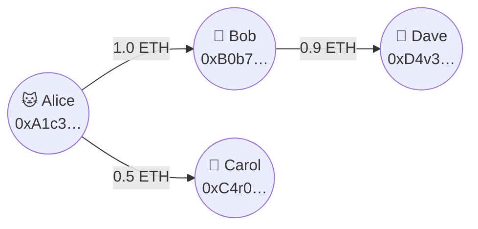
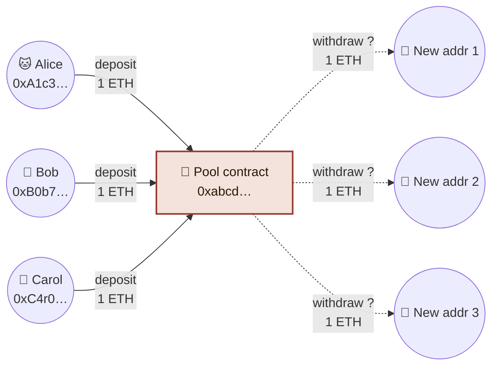
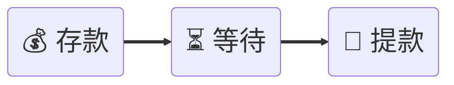
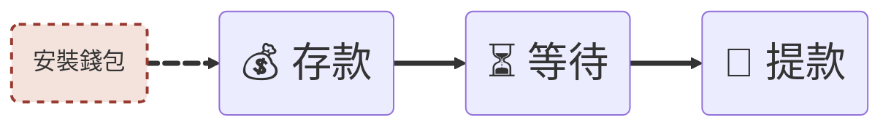
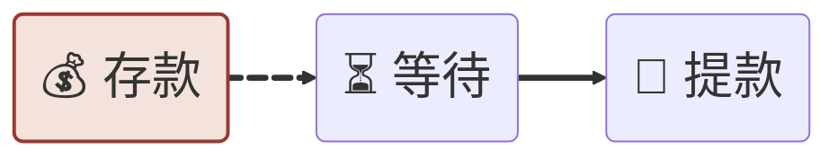
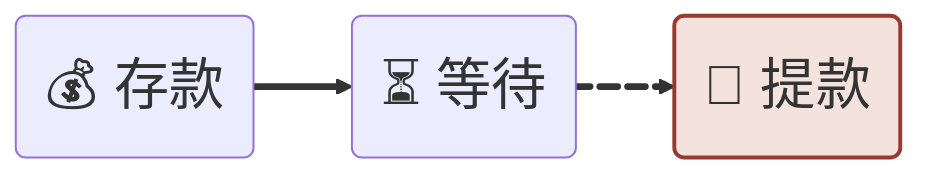
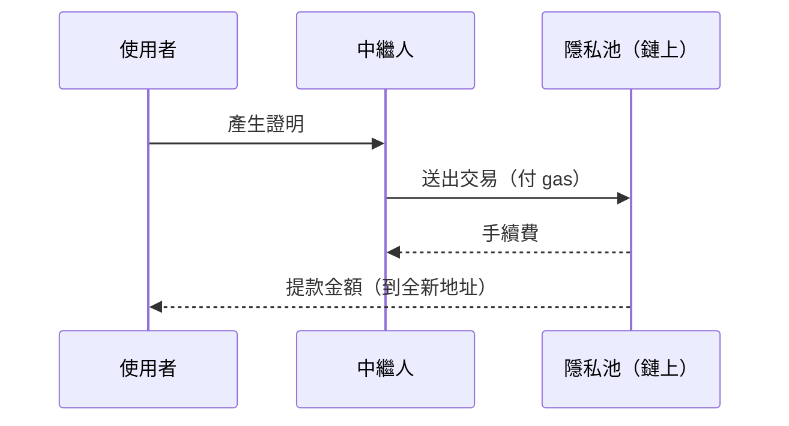

+++ {"class": "title-slide"}

# 隱私支付實作工作坊：從龍捲風現金到隱私池

**Tornado Cash、Privacy Pool 等混幣器（Mixer）簡單入門**

CC · COSCUP 2026

:::notes
你們每個人看起來有很多秘密
:::

---

## 這場演講是什麼

看一看區塊鏈隱私支付的現況。

1. 你會操作過一次混幣器。
3. 看一下人們踩過什麼雷。

---

## 關於 CC

- 2021~2024 開發零知識證明密碼學的應用
    - Semaphore: 通用匿名架構
    - MACI: 抗賄賂投票架構
    - ZkEVM: 改善區塊鏈驗算效率的技術
- 現在做一些獨立研究：興趣包含區塊鏈相關的經濟研究、形式證明等。
- 可以問我：以太坊 Ethereum 底層與密碼學

---

# 一場飯局

:::notes
吃飯分帳
用虛擬貨幣
:::

+++ {"class": "chapter"}

# Part 1: 真實的問題

> 使用區塊鏈，像是把銀行帳戶放在推特上曬

:::notes
混幣器要解決的問題，其實是區塊鏈自己的問題
:::

---

## 混幣器原理：透明的交易圖

Alice 轉給 Bob 和 Carol，Bob 轉給 Dave。誰給誰多少錢都看得見。

:::notes
區塊鏈會記載一筆交易的發送方、收受方、和金額。
任何人都能重建這張圖，追蹤資金流向。
debank.com
arkham intelligence
:::

---

## 混幣器原理：進入池子之後

Alice、Bob、Carol 都存入同一個池子合約，再各自提款到新地址。人們看得到誰存款、誰提款，但連不起兩者的關係。

:::notes
希望大家今天能記得這張圖
:::

---

# 混幣器專案

- 2019 Tornado Cash 龍捲風現金
- 2025 **Privacy Pools 隱私池** （本日使用，ASP 審查，部分提款）

:::notes
混幣器是區塊鏈、零知識證明應用的前哨站
問 Vitalik 最美的區塊鏈應用是什麼？會是 TC, Uniswap
技術上最精簡，適合研究。所有隱私應用的基礎
所有價值上的衝突反應。
:::

+++ {"class": "chapter"}

# 本日任務

---

## Get in, Get out

理想上，等待時間最好是 **一個月** 以上。

:::notes
隱私池的文件沒有提到具體等待時間。這個數字是親朋好友說的
https://github.com/tornadocash/docs/blob/en/general/tips-to-remain-anonymous.md
:::

+++ {"class": "chapter"}

# 錢包（鑰匙圈）

---

## 錢包（鑰匙圈）

- 並不是管理你的錢
- 而是管理你的私鑰

:::notes
各家都叫他錢包，英文叫做 Wallet
下載錢包是有點可怕的事。
但實際上更是個鑰匙圈
密碼鎖範例
:::

---

## 安裝流程

- 到 ambire.com ，依照自己瀏覽器安裝擴展程式
- [ ] 建立新帳戶 Create new account
- [ ] 建立救援密語 Create Recovery Phrases
  - 要救援帳戶及資產使用
- [ ] 設定解鎖密碼 Set Extension Password
  - 錢包在閒置時會自動鎖定

---

## 助記詞 Seed Phrases

- 私鑰是種能產生巨大排列組合的資訊：可以是數字或文字。
  - 密碼學利用「只有你知（Something you know）」別人不知道你的私鑰。也猜不到
- 私鑰的形式
  - 助記詞

---

# 進入隱私池

TODO: 加入 QR Code

- 模擬版
  - [ ] 選擇連結錢包
  - [ ] 取得測試鏈的測試幣
- 真實版（有錢包與以太幣者）
  - 造訪 privacypools.com

+++ {"class": "chapter"}

# 存款 Deposit

---

## 步驟

- 連結網頁與帳戶：按 Connect Wallet
  - 選 Ambire （接著解鎖錢包）
  - 目的：能以該帳戶發
- 產生 Seed Phrase
  - 按 Continue with Wallet （需要錢包簽署兩次）
  - 下載救援密語
- 按 Deposit
  - 輸入欲存款的金額，按 Confirm （錢包簽署交易）
- 存款會在 Pending 狀態，等 ASP 審核通過

---

## ASP 關聯集提供者

**關聯集（Association Set）** 在隱私池是允許清單。被允許日後才能提款。

關聯集提供者會排除交易所遭竊，或是各種已知的犯罪帳戶。

龍捲風現金的設計，讓北韓駭客與一般使用者混在一起。隱私池的設計讓他們分開。

:::notes
為善不欲爲人知
:::

---

## ASP 作惡如何？

如果 ASP 任意拒絕人怎麼辦？

- 誰決定誰是好人壞人？
- 怒退（Rage quit）：隱私池讓被拒絕的人可以安全提款，但不享有隱私效果 -- 存提款的金流連結不會斷開。

+++ {"class": "chapter"}

# 提款 Withdraw

---

## 提款步驟

- 按 Withdraw 
  - 確認鏈、幣種
  - 選擇要提款的存款紀錄（PA-1 之類）
  - 提款地址：**請用錢包產生全新地址**
  - 金額可以部分提款。
  - 中繼人選項可以選預設的
  - 按 Review Withdrawl (再次檢查後，按 Confirm)
- 等待零知識證明產出完成即可

---

## 提款的幕後機制

:::notes
你的電腦有沒有熱熱的？
:::

---

# 重要：不要使用舊地址當提款地址

不然就失去使用隱私池的意義了！

提款地址一定要是**全新的**

---

# 零知識證明的部分

- 像是一個比較智慧的數位籤章
  - 知道私鑰的人才有辦法簽
- 簽章 + 區塊鏈合約檢查提款資格
  1. 屬於存過款的一員
  2. 有在白名單內
  3. 尚未提過款

:::notes
想像手機註冊存款者指紋
:::

+++ {"class": "chapter"}

# 回顧

---

## 隱私池這個專案怎麼樣？

- 美的部分
  - 非托管：沒有人能凍結你的資金
  - 開源：任何人都可以審計程式碼
  - 選擇性揭露：可以在不揭露身份的情況下證明合規
  - 怒退保障：被 ASP 拒絕可以安全取回資金
  - 部分提款：不用一次提取巨大的金額（龍捲風現金沒這功能）
- 醜的部分
  - **ASP 是中心化信任點**：ASP 決定誰是「乾淨」的。但作惡能力有限。
  - **法律地位仍不確定**：應該政府和我們一樣困惑
  - **工具需要一定技術門檻**：小閃失可能喪失隱私保證
  - 費用： 0xbow 收存款 0.5% ，中繼人收提款 0.1% ，以太幣存款手續費大約台幣 10 元有找。

:::notes
:::

---

## 今天我們做了什麼

:::notes
:::

---

## 額外建議

- [ ] 視需求用 Tor Browser 或 VPN 連線
- [ ] 選擇常見的金額（0.1 ETH，不要奇怪的數字）

:::notes
隱私池最主要的目的是清除鏈上蹤跡。鏈下需要其他技術配合
:::

---

## Takeaway

- 存款：
  - 有沒有找對網頁，檢查鏈與幣種都正確。
  - 注意匿名集大小
- 等待：請耐心以星期或月為單位等待
- 提款：確認提款地址是全新的。提款之後避免再與舊的帳戶有任何互動。

請小心保管自己的私鑰與恢復密語。遺失密語等於遺失資產。

---

## 資源

- [privacypools.com](https://privacypools.com) — Privacy Pool 官方
- [我的文章：隱私池的設計](https://liangcc.me/zh-tw/posts/2025-10-11_privacy_pool/)

---

## Q&A

+++ {"class": "chapter"}

# 延伸討論

---

## 麻雀雖小五臟俱全

混幣器可以

- 技術上，有所有隱私類應用的基本設計。研究混幣器，就能看懂其他應用了
- 看到所有區塊鏈上所有的矛盾
  - 完全無法追蹤的金流是什麼樣的世界？好處與壞處是什麼？
  - 隱私這個價值是否可以無限上綱？在北韓駭客面前如何取捨？
  - 是否存在一個完全不需要治理的工具？
  - 隱私池讓 ASP 主導審查。雖然有怒退功能，但我們把治理的真空全部推到 ASP 上。

---

## 工具本身也有風險：開發者被捕

Tornado Cash 不只是技術問題，也是法律問題。

- 2022 年：美國財政部制裁 Tornado Cash 合約
- 2023 年：開發者 Alexey Pertsev 在荷蘭被捕，判刑超過五年
- Roman Storm 在美國被定罪

**對你的意義：** 使用被制裁工具，在某些司法管轄區可能有法律風險。

:::notes
大家酌情使用
:::

+++ {"class": "chapter"}

# Ethereum FAQ

---

## 在開始之前：什麼是「鏈」？

- 每條區塊鏈都是一本**獨立的帳本**——Ethereum、Bitcoin、Solana 互不相通。
  - 可以當成不同的電腦
- 「EVM 相容」的鏈（Ethereum、Base、Arbitrum…）共用同一套合約執行環境，錢包、工具可以直接沿用
  - 想像不同的電腦，但一樣的作業系統
- 非 EVM 鏈（Bitcoin、Solana…）有自己的一套規則，錢包、地址格式都不一樣

:::notes
這是為了讓不熟悉區塊鏈的聽眾跟上後面的內容。
重點：不是所有「鏈」都相容，EVM 只是其中一種共用環境。
:::

---

## 原生代幣 vs 合約代幣

---

原生代幣（ETH／SOL）是協議內建、用來付 gas；合約代幣（ERC20／SPL）是**別人**在這條鏈上發行的代幣，兩者不是同一回事。今天工作坊存入 Privacy Pool 的，是 Ethereum 上的原生 ETH。
