+++ {"class": "title-slide"}

# The Weird Nature of Cryptography Products

**Do they have to be invisible?**

CC · 2026

:::notes
Inspired by a panel at Devcon Thailand 2024, plus a bunch of private conversations since.
:::

+++

## Inspired by Mashbean's Initiative

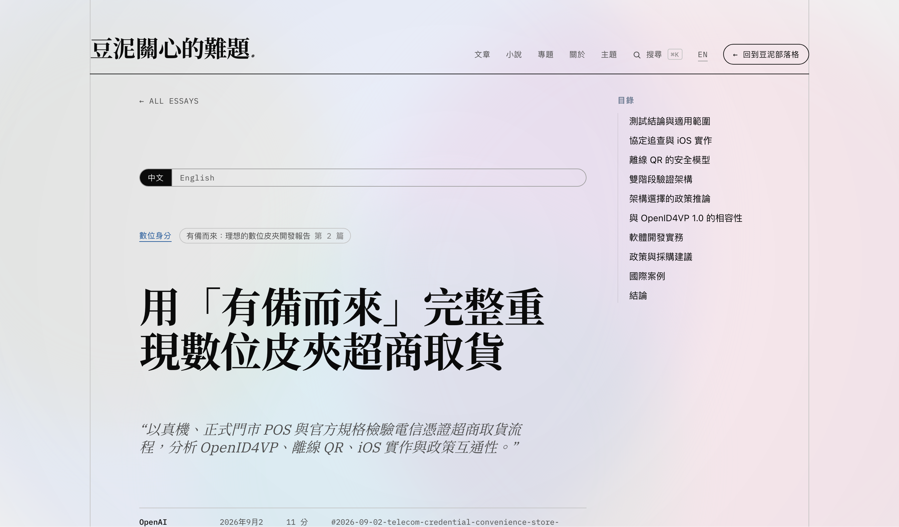

**"Recreating a digital wallet's convenience-store pickup, end to end"**

:::notes
pro.mashbean.net — full protocol trace: OpenID4VP, offline QR, iOS implementation, policy implications.
:::

---

## Browser-frame template demo

parity.fund/graypunk/

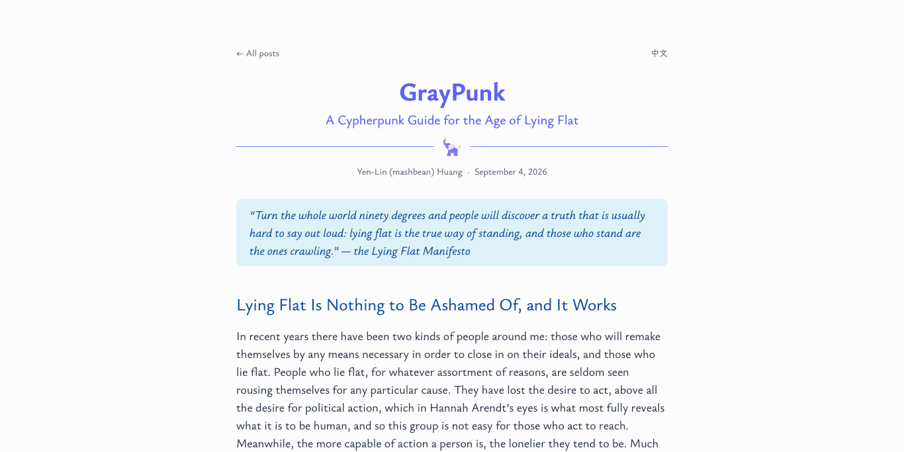

---

## Pick up a package the old way

- Say your name
- Last 3 digits of phone number
- Present an ID

<small>Fields on this ID: name, date of birth, issue date, photo, gender, ID number, parents' names, spouse's name, military service status, place of birth, and current address</small>

---

## Pick up a package with a digital wallet

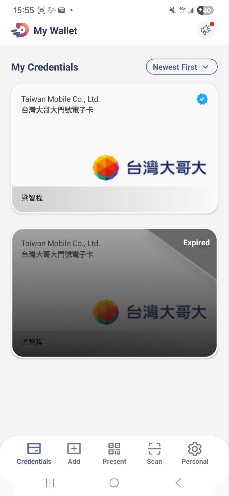

Credentials

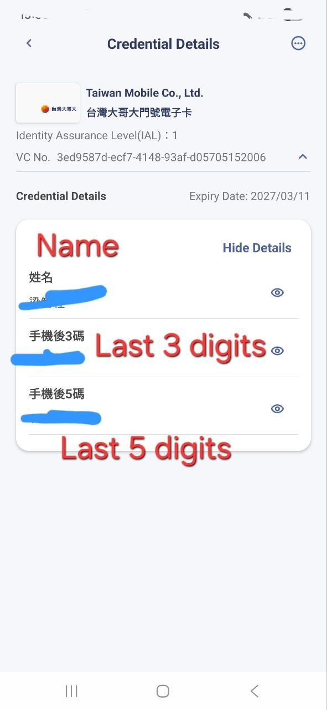

Selective disclosure

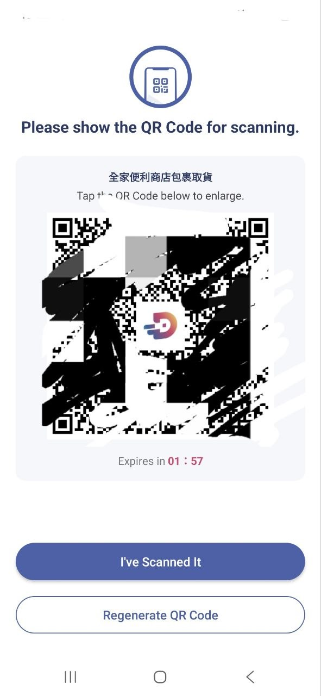

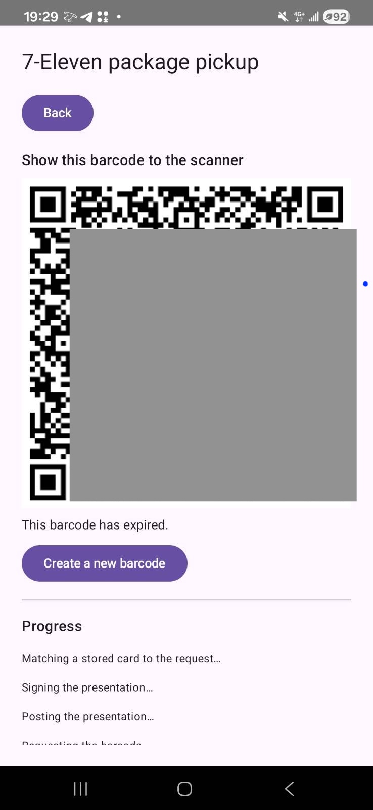

My Slop

:::notes
:::

---

## Live test of a selective-disclosure credential

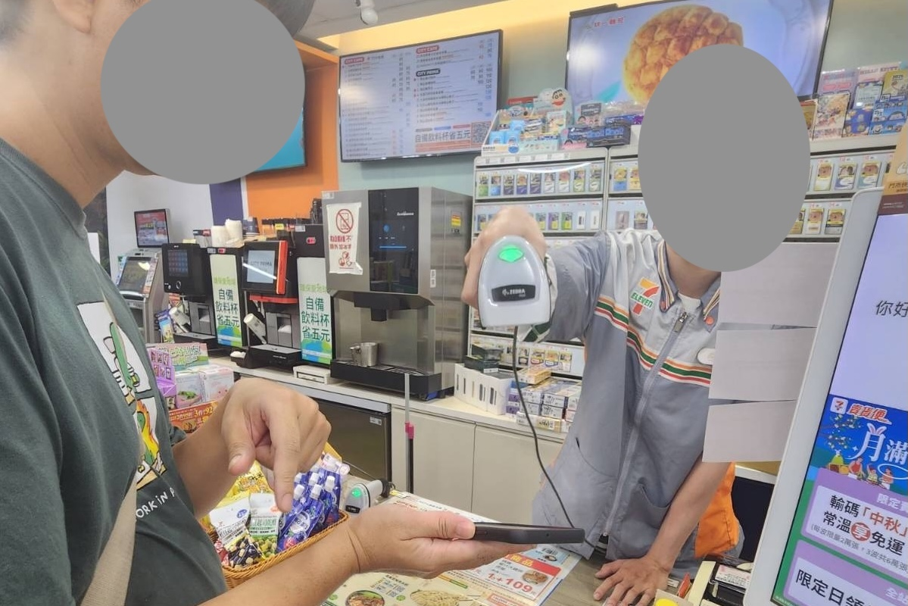

**It looks exactly like scanning a QR code.**

:::notes
I was full of excitement
but the flow is very mundane
:::

+++

## Cryptography products are unimpressive

<ul>
<li class="fragment">Sending a transaction: gas, networks, tokens, addresses — feels no different from a bank app</li>
<li class="fragment">HTTP → HTTPS: what does that extra "s" actually give you?</li>
<li class="fragment">Signal: name three of its cryptography features. Can't? You use it anyway.</li>
</ul>

:::notes
Think about your first ChatGPT experience.
:::

---

### Substitution view

Cryptography is a **simulated trusted third party**.

Everything it does, a trusted party could also do.

It reproduces an existing experience.

### Generation view

Cryptography is **true and real**.

It enforces a new physics on data — some trust could never be built any other way.

Can it create a new experience?

:::notes
reproduce -- when we remove enough friction
new experience -- if we are blind to abstraction

You can't print money, you can't double spend.
:::

+++

## The exceptionalism of cryptography products

> The design priorities required to achieve usable security ... are significantly **different** from those of general consumer software.
>
> — Whitten & Tygar, Why Johnny Can't Encrypt (1999)

:::notes
Users sent their secret key over email.
:::

---

## Five properties that make cryptography a UX minefield

- Unmotivated user
- Abstraction
- No feedback
- Barn door
- Weakest link

:::notes
Unmotivated: Signal installs in Ukraine spiked only after the invasion; a RightsCon security advisor gave up buying YubiKeys for activists over funding.
Abstraction: what does it even mean to "sign" a message with a "key"? People sign paper with a pen.
No feedback: write your password on a sticky note, you won't find out what's wrong until it's too late.
Barn door: lost private keys behave exactly like a lock left open once.
Weakest link: a selective-disclosure wallet feels pointless if you already leaked the same data via a store loyalty program.
:::

---

### Unmotivated user

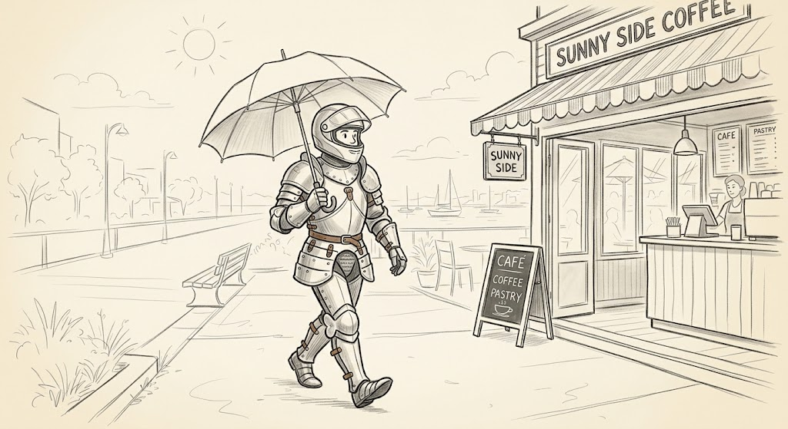

Security is a secondary goal.

:::notes
People do not generally sit down at their computers wanting to manage their security.
Users want to get a message sent, 
Signal installs in Ukraine spiked only after the invasion
Let me show you what a motivated user looks like. From Mashbean: wear armor to get breakfast.
:::

---

### Abstraction

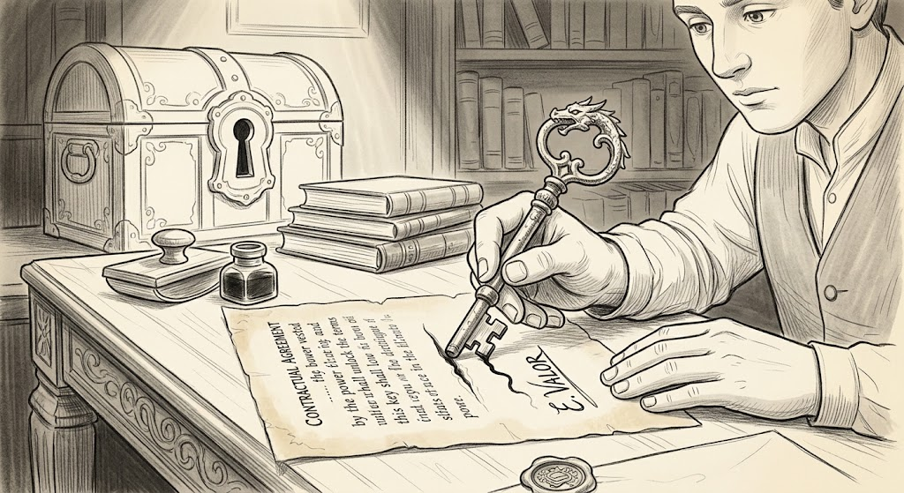

Rules are alien and unintuitive to users.

:::notes
Analogies are heavily relied upon.
:::

---

### No feedback

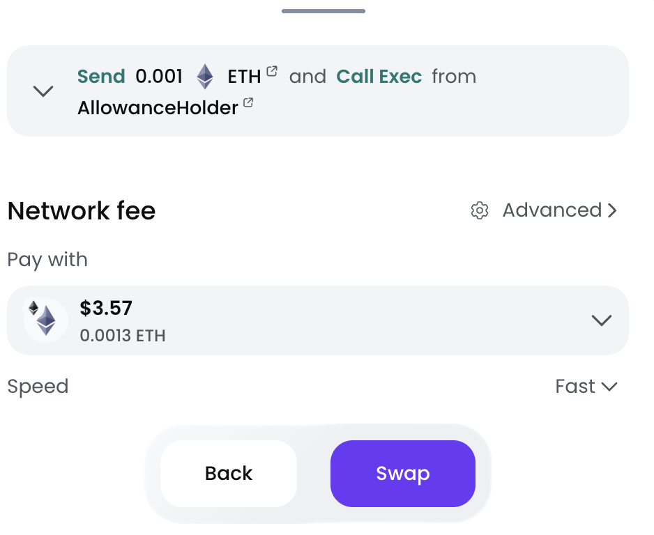

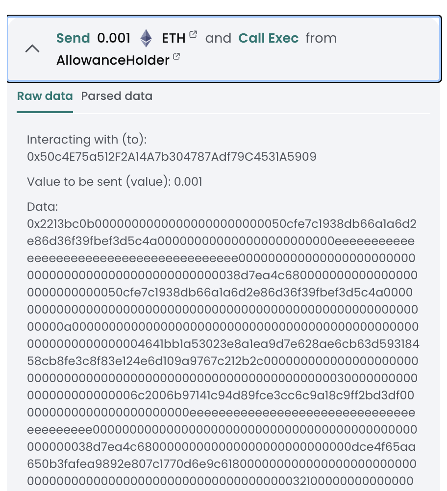

You can't tell if you did it right.

:::notes
https://eips.ethereum.org/EIPS/eip-7730
https://clearsigning.org/
:::

---

### Barn door

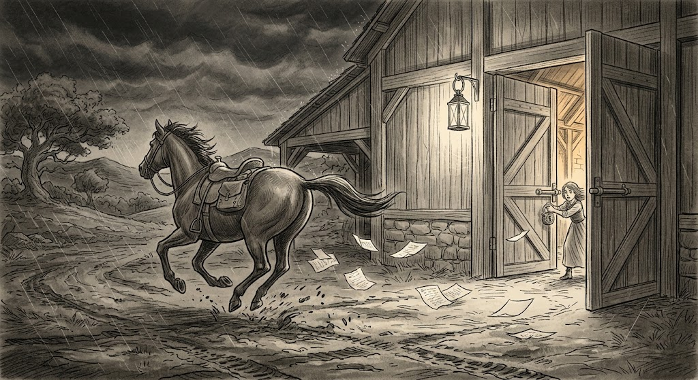

Lost private keys behave exactly like a lock left open once.

:::notes
What can Coldcard users do once they've lost crypto to a hack?
:::

---

### Weakest link

A system is only as strong as its weakest link.

:::notes
Lots of security improvements might go unappreciated because they're not on your weakest link.

A selective-disclosure wallet feels pointless if you already leaked the same data via a store loyalty program.
:::

+++

## Reframe: three kinds of goods

<ul>
<li class="fragment"><b>Search good</b> — check quality <em>before</em> buying (an apple's freshness)</li>
<li class="fragment"><b>Experience good</b> — check quality <em>after</em> using it (a meal, a movie)</li>
<li class="fragment"><b>Credence good</b> — can't judge quality even after using it (a doctor's treatment)</li>
</ul>

:::notes
I started to revisit cryptography products I've used in my life.
I also tried to use econ language to describe those Johnny properties.
:::

---

## Cryptography products are credence goods

Do you know whether your doctor's treatment, or your mechanic's fix, was actually necessary?

Expert services are invisible — **just like cryptography**.

Every product decomposes into two parts:

<ul>
<li class="fragment">an <b>experience-good</b> part (message sent, balance sent — clear, observable)</li>
<li class="fragment">a <b>credence-good</b> part (the cryptography underneath — you take it on faith)</li>
</ul>

+++

## Loop-engineering in security

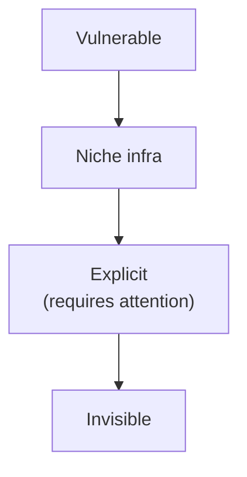

<ul>
<li class="fragment">Why loop you in: a threat is present</li>
<li class="fragment">Why loop you out: delegation works</li>
    <ul>
    <li class="fragment"> Machines know your intent really well </li>
    <li class="fragment"> People behind machines (devs, govs, standard bodies) are aligned with you</li>
    </ul>
</ul>

:::notes

A design ladder: from HTTP-under-attack, to a product nobody's adopted yet, to one that works but demands attention, to one nobody thinks about.

:::

---

## Case study: HTTPS's 23-year climb

<ul>
<li class="fragment">1995 — SSL ships, credit-card pages only; cracked within a minute</li>
<li class="fragment">2010–13 — Snowden: "encrypt sensitive pages" → "encrypt everything"</li>
<li class="fragment">2016 — Let's Encrypt makes certificates free</li>
<li class="fragment">2018 — Chrome marks <em>all</em> HTTP "not secure"</li>
</ul>

**The bottleneck was coordination.**

:::notes
Compute overhead was under 2% of CPU even in 2010. The real toll was $50–150/year per certificate plus manual renewal — Let's Encrypt (a nonprofit, ~$7M/year) removed that, Chrome (a browser vendor) supplied the social pressure to switch. Neither alone was enough.
:::

+++

## Takeaways for builders

<ol>
<li class="fragment"><b>Diagnose the components</b> — what's experience-good here, what's credence-good?</li>
<li class="fragment"><b>Don't market the credence-good part as a feature</b> — don't make users audit your cryptography for free</li>
<li class="fragment"><b>Prefer absorbing judgment over educating the user</b> — ask who should actually own this problem</li>
</ol>

