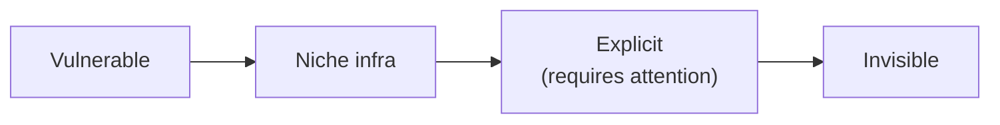

+++ {"class": "title-slide"}

# The Nature of Cryptography Products

**Why they're invisible — and what credence goods teach us about building them**

CC · 2026

:::notes
Inspired by a panel at Devcon Thailand 2024, plus a bunch of private conversations since.
:::

+++

## Inspired by Mashbean's Innitiative

**"Recreating a digital wallet's convenience-store pickup, end to end"**

:::notes
pro.mashbean.net — full protocol trace: OpenID4VP, offline QR, iOS implementation, policy implications.
:::

---

## Pack up a package the old way

- Say your name
- Last 3 digits of phone number
- Present an ID

<small>Fields on this ID: name, birth day, issue date, photo, gender, ID number, names of parents, name of the spouse, military service status, birth and current address </small>

---

## Pick up a package with Digital Wallet

Credentials

Selective disclosure

My Slop

:::notes
This is the real screen, mid-flow, right before that barcode got scanned. All that cryptographic work underneath, and the output is a QR code — one that even expires, just like any other. "This barcode has expired" is visible right there. It behaves exactly like a normal QR code, failure modes included.
:::

---

## Live test of a selective-disclosure credential.

**It looks exactly like scanning a QR code.**

:::notes
I was full of excitement
but the flow is very mundane
:::

+++

## Cryptography products are unimpressive

<ul>
<li class="fragment">Sending a transaction: gas, networks, tokens, addresses — feels no different from a bank app</li>
<li class="fragment">HTTP → HTTPS: what does that extra "s" actually give you?</li>
<li class="fragment">Signal: name three of its cryptography features. Can't? You use it anyway.</li>
</ul>

:::notes
Think about your first ChatGPT experience. 
:::

---

### Substitution view

Cryptography is a **simulated trusted third party**.

Everything it does, a trusted party could also do.

### Generation view

Cryptography is **true and real**.

It enforces a new physics on data — some trust could never be built any other way.

:::notes
Cryptocurrency as the example that cuts both ways: "just a better bank app" vs. "a global ledger no bank coordination could ever build."
We'll come back to this — it's not actually a dichotomy.
:::

+++

## Why Johnny Can't Encrypt (1999)

> The design priorities required to achieve usable security ... are significantly different from those of general consumer software.
>
> — Whitten & Tygar

The paper studied one piece of software: **PGP**.

:::notes
Users sent their secret key through the email.
:::

---

## Five properties that make cryptography a UX minefield

<ul>
<li class="fragment"><b>Unmotivated user</b> — security is a secondary goal</li>
<li class="fragment"><b>Abstraction</b> — a new physics of data, not of paper and pens</li>
<li class="fragment"><b>No feedback</b> — you can't tell if you did it right</li>
<li class="fragment"><b>Barn door</b> — once leaked, always leaked</li>
<li class="fragment"><b>Weakest link</b> — one gap undoes the rest</li>
</ul>

:::notes
Unmotivated: Signal installs in Ukraine spiked only after the invasion; a RightsCon security advisor gave up buying YubiKeys for activists over funding.
Abstraction: what does it even mean to "sign" a message with a "key"? People sign paper with a pen.
No feedback: write your password on a sticky note, you won't find out what's wrong until it's too late.
Barn door: lost private keys behave exactly like a lock left open once.
Weakest link: a selective-disclosure wallet feels pointless if you already leaked the same data via a store loyalty program.
:::

+++

## Reframe: three kinds of goods

<ul>
<li class="fragment"><b>Search good</b> — check quality <em>before</em> buying (an apple's freshness)</li>
<li class="fragment"><b>Experience good</b> — check quality <em>after</em> using it (a meal, a movie)</li>
<li class="fragment"><b>Credence good</b> — can't judge quality even after using it (a doctor's treatment)</li>
</ul>

+++

## Cryptography products are credence goods

Do you know whether your doctor's treatment, or your mechanic's fix, was actually necessary?

Expert services are invisible — **just like cryptography**.

Every product decomposes into two parts:

<ul>
<li class="fragment">an <b>experience-good</b> part (message sent, balance sent — clear, observable)</li>
<li class="fragment">a <b>credence-good</b> part (the cryptography underneath — you take it on faith)</li>
</ul>

+++

## Credence-goodness is relative

<ul>
<li class="fragment">A neurosurgeon isn't fooled by a routine GP scan on the same panel</li>
<li class="fragment">I've built ZK apps for years — I can <em>implement</em> a SNARK</li>
<li class="fragment">I still can't tell you if a <b>new</b> SNARK scheme is sound. That's a different, years-long kind of training.</li>
</ul>

To an expert, a lot of crypto products feel like experience goods. To everyone else, they're credence goods.

+++

## Two ways adoption fails

<ul>
<li class="fragment"><b>Underuse</b> — people don't know the value (abstraction + no feedback + barn door → unmotivated)</li>
<li class="fragment"><b>Misuse</b> — people know the value, but use it wrong</li>
</ul>

:::notes
Why this matters beyond individual users: information-leak minimization has positive externalities (fraud, scams), and wider adoption has herd-immunity effects. Worth designing for the average person, not just experts.
:::

+++

## So — substitution, or generation?

**zkp2p:** zkTLS turns a Venmo receipt into a proof → swap USD for crypto.

<ul>
<li class="fragment">To the <b>layperson</b>: just another way to swap currency. Substitution.</li>
<li class="fragment">To the <b>expert</b>: a 20-year-old email signature standard (DKIM), repurposed into a trustless proof. Generation.</li>
</ul>

Same product. Different answer, depending on who's asking.

:::notes
zkEmail is literally built on DKIM — the boring, 20-year-old anti-spam standard every email already carries. The move is finding new leverage in old, ambient infrastructure.
:::

+++

## If it's stuck as a credence good — what do we do?

A design ladder: from HTTP-under-attack, to a product nobody's adopted yet, to one that works but demands attention, to one nobody thinks about.

+++

## Case study: HTTPS's 23-year climb

<ul>
<li class="fragment">1995 — SSL ships, credit-card pages only; cracked within a minute</li>
<li class="fragment">2010–13 — Firesheep, then Snowden: "encrypt sensitive pages" → "encrypt everything"</li>
<li class="fragment">2016 — Let's Encrypt makes certificates free</li>
<li class="fragment">2018 — Chrome marks <em>all</em> HTTP "not secure"</li>
</ul>

**The bottleneck was coordination, not cost.**

:::notes
Compute overhead was under 2% of CPU even in 2010. The real toll was $50–150/year per certificate plus manual renewal — Let's Encrypt (a nonprofit, ~$7M/year) removed that, Chrome (a browser vendor) supplied the social pressure to switch. Neither alone was enough.
:::

+++

## Case study: MACI climbs the ladder by removing itself

<ul>
<li class="fragment">2019 — MACI: a trusted <b>coordinator</b> + a SNARK that only proves it didn't lie about the tally</li>
<li class="fragment">The coordinator still <em>sees</em> every plaintext vote</li>
<li class="fragment">2026 — <b>Interfold</b>: no coordinator. A rotating threshold committee, structurally unable to produce a single plaintext vote</li>
<li class="fragment">Same week: MACI's own repository is archived</li>
</ul>

Trust didn't disappear — it moved, and shrank.

+++

## Who absorbs the judgment?

<ul>
<li class="fragment"><b>The user</b> — educated into self-sovereignty</li>
<li class="fragment"><b>The feature provider</b> — Chrome deciding HTTP is unsafe</li>
<li class="fragment"><b>A standards body</b> — IETF (DKIM, OpenPGP), NIST (post-quantum crypto)</li>
<li class="fragment"><b>A nonprofit</b> — Let's Encrypt, the Signal Foundation</li>
<li class="fragment"><b>The government</b> — Taiwan's digital wallet, built and issued for you</li>
</ul>

---

## Taiwan's digital wallet, in practice

Stored credentials

Selective disclosure — reveal only what's needed

Same QR-code pattern, this time for FamilyMart pickup

:::notes
Same flow as the 7-11 test, but this time government-issued: a telecom credential, selective disclosure down to "last 3 digits" or "last 5 digits" of a phone number, and a QR code that expires just like the other one did.
:::

+++

## Takeaways for builders

<ol>
<li class="fragment"><b>Diagnose the components</b> — what's experience-good here, what's credence-good?</li>
<li class="fragment"><b>Don't market the credence-good part as a feature</b> — don't make users audit your cryptography for free</li>
<li class="fragment"><b>Prefer absorbing judgment over educating the user</b> — ask who should actually own this problem</li>
</ol>

+++ {"class": "centered"}

## Cryptography products aren't unimpressive.

They're credence goods, doing their job by staying invisible.

+++ {"class": "centered"}

## Q&A
