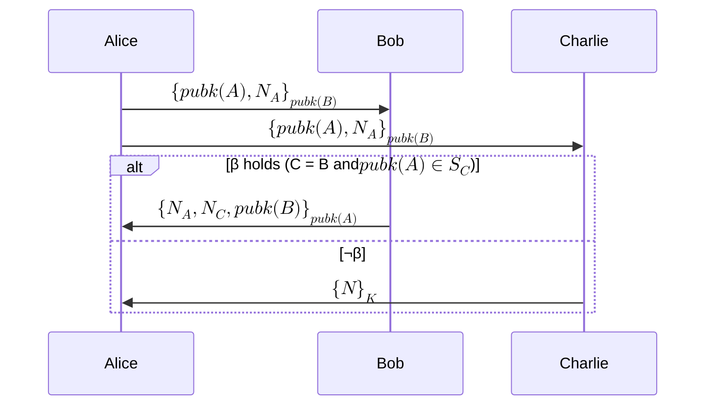
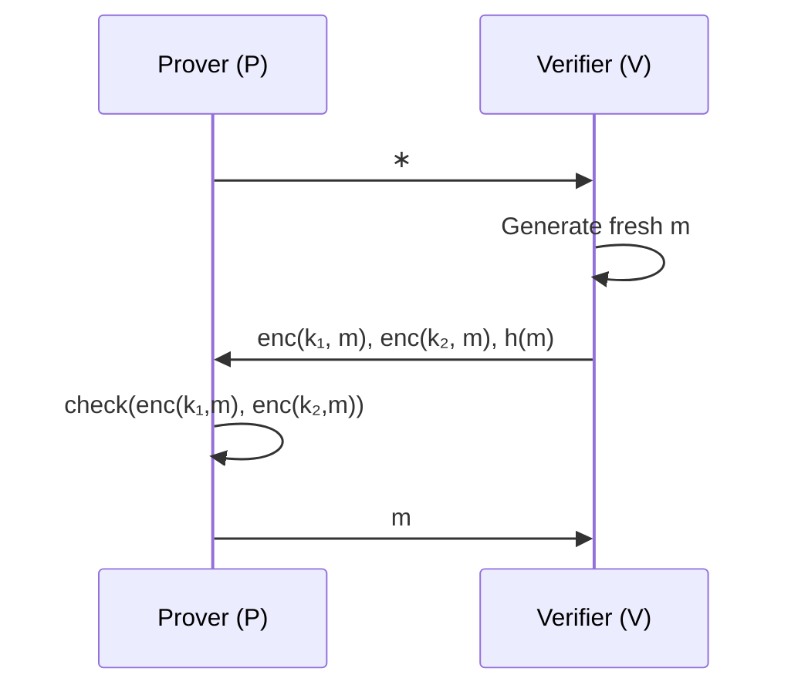

# Can We Formally Verify Privacy Properties?

## Motivations

We're interested in finding subtle bugs in Tornado Cash-like applications, Semaphore, and Privacy Pools. For example, what if a developer accidentally asks a user to input their deposit index into the Solidity withdrawal function? This is plausible when developers are building quickly. Can we automatically detect this without relying on manual checks?

Automation could be even more valuable when designing complex privacy applications, such as the old Unirep.

## Recent Advances in Formal Verification

Recent advances allow us to handle completeness and soundness by reasoning about program inputs and outputs.

[github.com/zksecurity/evm-asm/blob/main/EvmAsm/Evm64/Add/Program.lean](https://github.com/zksecurity/evm-asm/blob/main/EvmAsm/Evm64/Add/Program.lean)

[blog.zksecurity.xyz/posts/clean/](https://blog.zksecurity.xyz/posts/clean/)

However, privacy requires reasoning about how information spreads between parties. That's where epistemic logic comes in.

## Epistemic Approach

SNARKs are usually defined in a complexity/computational model: "Given a polynomial-time attacker, the probability of breaking soundness is negligible."

The epistemic approach models things more binarily: "Without learning the private key, I can't break the ciphertext."

- Cryptography is assumed to be perfect. 

### Process

- Describe the protocol in a mathematical language. Specify what states and state transitions the system can have.
- Specify the security goal in this language, usually defining the knowledge an agent has. For example, an attacker shouldn't learn my private key.
- Run the interpreter and track the knowledge possessed by attackers and honest parties.
- Verify whether the security goal holds in the end.

## What Should Complete Tooling Look Like?

[@rajaonaEpistemicModelChecking2024] is a proof of concept for what full-fledged epistemic logic tooling can achieve. Existing tools have these limitations:

- Existing tooling can check either attacker-reasoning or honest-party reasoning, but not both
- Existing tooling verifies only partial properties, whereas this paper handles anonymity, unlinkability (weak and strong), whitelist privacy, etc.
- Existing tooling verifies some properties approximately, leading to false positives.

The paper demonstrates cases like private authentication protocols, where messages are sent to designated targets.

### Performance Note

51 minutes for some Basic-Hash cases, with timeouts beyond that.

### Notes

Note that unlinkability is defined differently in different contexts. In epistemic models, unlinkability means there's no way to tell which world you are in. In Tornado Cash, unlinkability is defined probabilistically: it's unlikely to link participants in the anonymity set if they follow best practices.

## Defining ZKPs in Epistemic Logic

[@costaDynamicEpistemicVerification] specifies security properties for ZKPs.

**Broken Key Protocol:** V has two keys, one of which is compromised. P has the compromised key and proves it to V without revealing which key is compromised.

### What's Missing?

The Dolev-Yao (DY) attacker model. Modeling DY attackers appears to involve additional complexities.

## Tornado Cash-Like Situations

What's required?

- DY attacker model to observe all messages
- Modeling ZK in epistemic logic
- Dynamism
- Practical tooling

### Other Concerns

- **Complexity explosion:** The epistemic method requires tracking knowledge. A few interactions can cause the state space to explode.
- **Public chain nature:** In Tornado Cash-like applications, messages are broadcast publicly. Most epistemic models target private interactions.

## What Do Real Tornado Cash-Like System Hacks Look Like?

Real-world Tornado Cash-like systems have had critical bugs, though often different from what epistemic verification would catch.

**February 2026: Foom and Veil Cash** - Skipped the trusted setup entirely. [Foom](https://smartcontractshacking.com/hacks/foom-cash-hack-2026), [Veil](https://github.com/DK27ss/VeilCash-5K-PoC)

### Zcash Wallet App Threat Model

[The threat model](https://zcash.readthedocs.io/en/latest/rtd_pages/wallet_threat_model.html) doc lists many privacy related invariants. These might be in interest to model in epistemic logic.

> - Can't tell what the user's current shielded balance is (aside from it being zero when the wallet is created)
> - Can't learn information about the value, memo field, etc. of shielded transactions the user sends/receives.
> - Can't find out one of the user's wallet addresses unless the user has given it out or the adversary has a guess for what it is.
> - ...

[bibliography]
