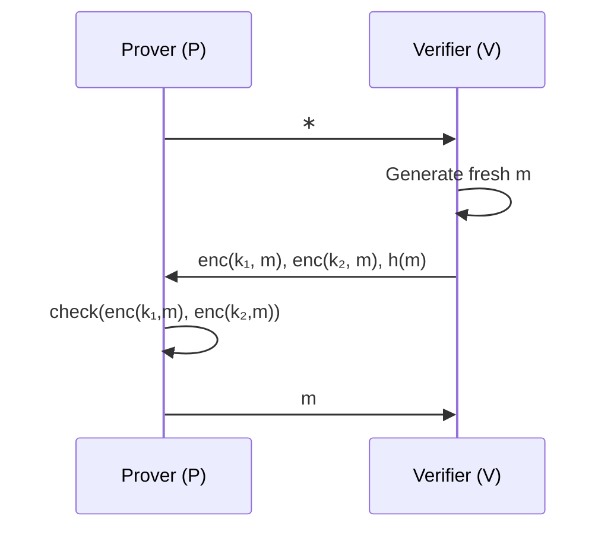

<!-- _class: title-slide -->

# Can We Formally Verify Privacy Properties?

**Epistemic logic, ZKPs, and the tools we don't have yet**

---

## Agenda

1. **The bug** — what could go wrong, and what did go wrong
2. **The gap** — why existing verification tools miss privacy
3. **Epistemic logic** — the missing piece
4. **State of tooling** — what exists, what's missing
5. **Open problems** — where to go from here

---

<!-- _class: centered -->

## Let's start with a real incident

---

## February 2026: Foom & Veil Cash

Two Tornado Cash-like mixers launched and were exploited within days.

> **Root cause:** The trusted setup was skipped entirely.

- Not a cryptographic attack
- Not a sophisticated exploit
- A **developer mistake** that formal checks should have caught

### The uncomfortable question

What other classes of bugs are we *not* catching?

---

## A Plausible Developer Mistake

Imagine building a Tornado Cash fork quickly.

```solidity
// Withdrawal function
function withdraw(
    uint256 depositIndex,   // ← accidentally exposed as public input
    bytes32 nullifier,
    bytes32 root,
    bytes calldata proof
) external { ... }
```

**The deposit index links withdrawals back to deposits.**

This completely breaks anonymity — and it's the kind of mistake that happens when moving fast.

> Can we *automatically* detect this without manual review?

---

## Where Formal Verification Stands Today

Recent advances handle **soundness** and **completeness** well:

- Reasoning about program inputs and outputs
- EVM bytecode verification (e.g. `evm-asm` in Lean 4)
- Circuit constraint verification (CLEAN framework)

### The blind spot

These tools reason about *computation*.

**Privacy requires reasoning about *information flow* between parties.**

---

## A Different Kind of Question

| Computational model | Epistemic model |
|---|---|
| Can an attacker *compute* X? | Does an attacker *know* X? |
| Probabilistic / complexity-based | Binary / possible-worlds |
| "negligible advantage" | "without the key, they can't learn it" |
| Handles ZK proofs well | Better for anonymity & unlinkability |

**Epistemic logic** gives us a framework to formally state and verify privacy properties.

---

## Epistemic Logic in One Slide

**Core idea:** model what each agent *knows* as a set of possible worlds.

- Agent *knows* P if P is true in *all* worlds consistent with their observations
- Attacker knows my private key → they can distinguish worlds where key = A vs key = B
- **Anonymity** = attacker cannot distinguish which world they're in

### The process

1. Describe the protocol as states + transitions
2. Specify the security goal (e.g. "attacker doesn't learn Alice's identity")
3. Run the interpreter, track knowledge per agent
4. Check whether the goal holds

---

## Example: Private Authentication

Alice wants to authenticate to Bob without Charlie learning she did so.

```
A → B : { pubk(A), N_A } encrypted with pubk(B)
A → C : { pubk(A), N_A } encrypted with pubk(B)

If β holds (C = B and pubk(A) ∈ S_C):
    B → A : { N_A, N_C, pubk(B) } encrypted with pubk(A)
Else:
    C → A : { N } encrypted with K
```

**What we're verifying:** Charlie cannot learn that Alice authenticated to Bob.

This is expressible — and checkable — in epistemic logic.

---

## ZKPs in Epistemic Logic

**Broken Key Protocol** — a concrete ZK example:

- Verifier V has two keys, one compromised
- Prover P knows the compromised key
- P proves knowledge *without revealing which key is compromised*



**Property to verify:** V learns that P has *a* key, but not *which* key.

This is expressible in dynamic epistemic logic (Rajaona et al. 2024).

---

## What Unlinkability Actually Means

⚠️ The same word means different things in different contexts.

| Context | Definition |
|---|---|
| **Epistemic models** | No way to distinguish which possible world you're in |
| **Tornado Cash** | *Probabilistically* unlikely to link depositor/withdrawer given anonymity set + best practices |

This distinction matters when choosing a verification approach.

The epistemic definition is **stronger** — and harder to achieve in practice.

---

## State of the Tooling

**Rajaona et al. (2024)** — closest to full-fledged epistemic model checking for protocols.

### What existing tools can do

- ✅ Check attacker reasoning *or* honest-party reasoning
- ✅ Verify some properties (anonymity, weak unlinkability)

### What's still missing

- ❌ Cannot check *both* attacker and honest-party reasoning simultaneously
- ❌ Approximate verification → false positives
- ❌ No **Dolev-Yao attacker model** for ZK settings
- ❌ No native support for ZKP semantics

---

## The Dolev-Yao Gap

The **Dolev-Yao (DY) model** is the standard attacker for cryptographic protocols:

- Attacker controls the network
- Can intercept, replay, modify, compose messages
- Cannot break cryptographic primitives

**Why it matters for Tornado Cash-like systems:**

All messages are broadcast publicly on-chain. The DY attacker is the *minimum* threat model.

Current epistemic tools don't handle DY attackers well. This is a significant open problem.

---

## The Complexity Problem

Epistemic verification tracks knowledge states across all agents.

> **51 minutes** for some basic hash protocol cases.
> Timeouts beyond that.

### Why it explodes

Each new interaction multiplies the number of possible worlds to track.

Public blockchain broadcasts make this worse — everything is observable, so the state space for an attacker is enormous.

**This is the practical blocker** even if the theory is sound.

---

## What We'd Want to Verify: Zcash Threat Model

The Zcash wallet threat model lists exactly the kind of invariants we'd want to check automatically:

> - Can't tell what the user's current shielded balance is
> - Can't learn value, memo field, etc. of shielded transactions
> - Can't find out a wallet address unless the user revealed it
> - ...

These are *epistemic* properties. They're about what an attacker *knows*.

Encoding these in a verifiable formal language is the end goal.

---

## What Complete Tooling Would Need

For Tornado Cash-like formal privacy verification:

| Requirement | Status |
|---|---|
| Dolev-Yao attacker model | ❌ Open problem |
| ZKP semantics in epistemic logic | ⚠️ Partial (Costa et al.) |
| Dynamic protocol support | ⚠️ Partial |
| Scalable state space handling | ❌ Unsolved |
| Public broadcast channel support | ❌ Missing |
| Practical tooling | ❌ Research-only |

---

## Open Problems

These feel tractable — not fundamental barriers:

1. **DY + epistemic logic unification** — formalism exists, tooling doesn't
2. **Symbolic ZKP representation** — how do you model a SNARK in possible-worlds semantics without computational assumptions?
3. **State space pruning** — can we exploit structure in ZK protocols to reduce blowup?
4. **Public channel handling** — most epistemic models assume private channels

---

<!-- _class: centered -->

## Summary

**We can verify soundness and completeness.**

**We cannot yet automatically verify privacy.**

Epistemic logic is the right framework — the tooling just isn't there yet.

*The bugs are real. The motivation is there. The research frontier is open.*

---

<!-- _class: centered -->

## Thanks

Questions?

---

*References: Rajaona et al. (2024) · Costa et al. · Zcash Wallet Threat Model · Foom/Veil Cash post-mortems*