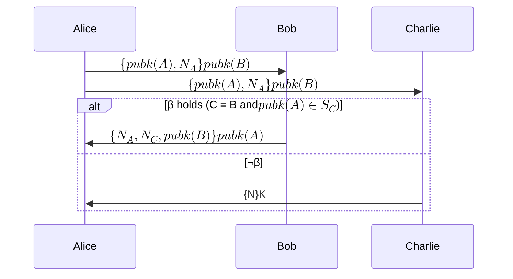

# Can we formally verify privacy properties?

Yes, but are we talking about [private messaging like] applications or [zeroknowledge proof like] applications?

Some relevant work includes [@costaDynamicEpistemicVerification].

[bibliography]
