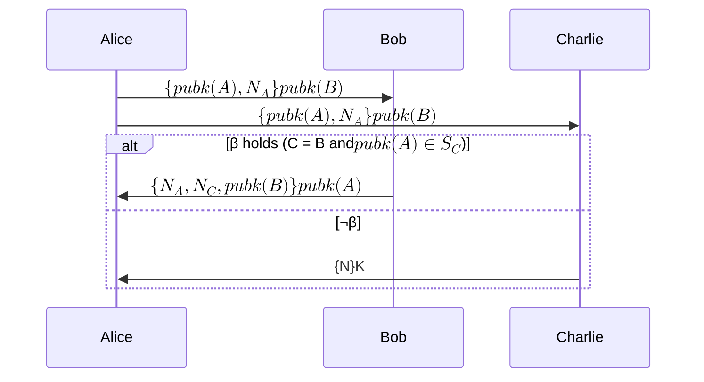
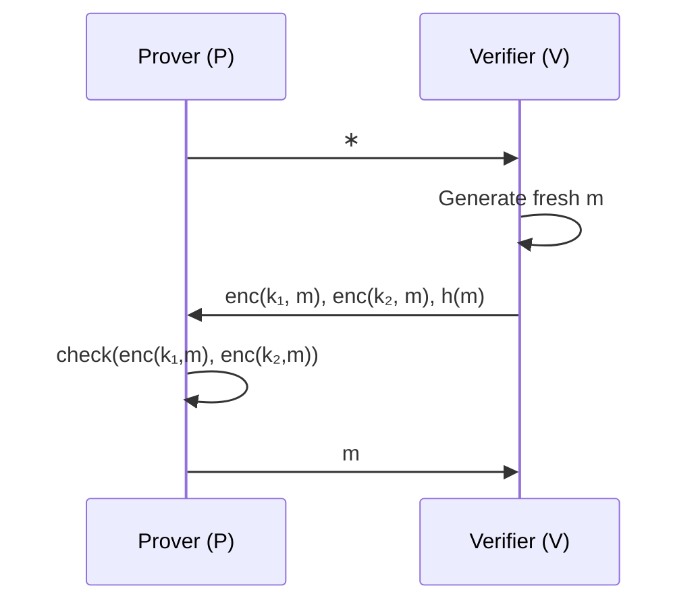

# Can we formally verify privacy properties?

Yes, but are we talking about [private messaging like] applications or [zeroknowledge proof like] applications?

## Recent advances in formal verification

github.com/zksecurity/evm-asm/blob/main/EvmAsm/Evm64/Add/Program.lean

https://blog.zksecurity.xyz/posts/clean/

## private messaging like protocols

[@rajaonaEpistemicModelChecking2024] targets private auth protocols, where messages are sent to designated targets.

### What failure mode looks like?

## Formally defining Zeroknowledge

[@costaDynamicEpistemicVerification].

Broken Key Protocol. V has two keys and one of them is compromised. P has the compromised key and proves it to V without revealing which key is compromised.

### What failure mode looks like?

## Tornado Cash like situation

What are still required?

- DY attacker to see all messages
- Modelling ZK in Epistemic logic
- Dynamism
- Actual tooling to use

## What real Tornado Cash like system hacks look like?

[bibliography]
