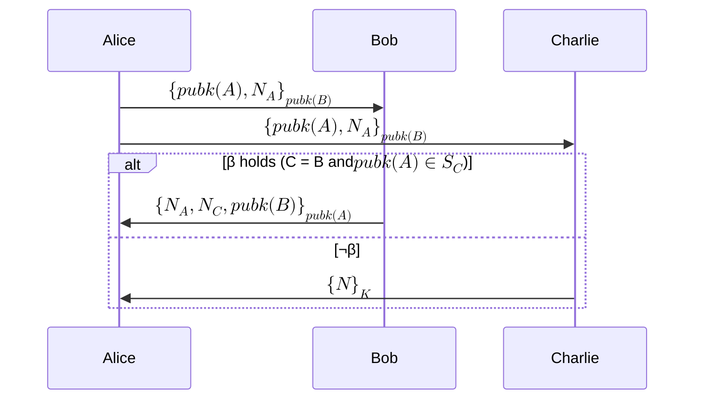
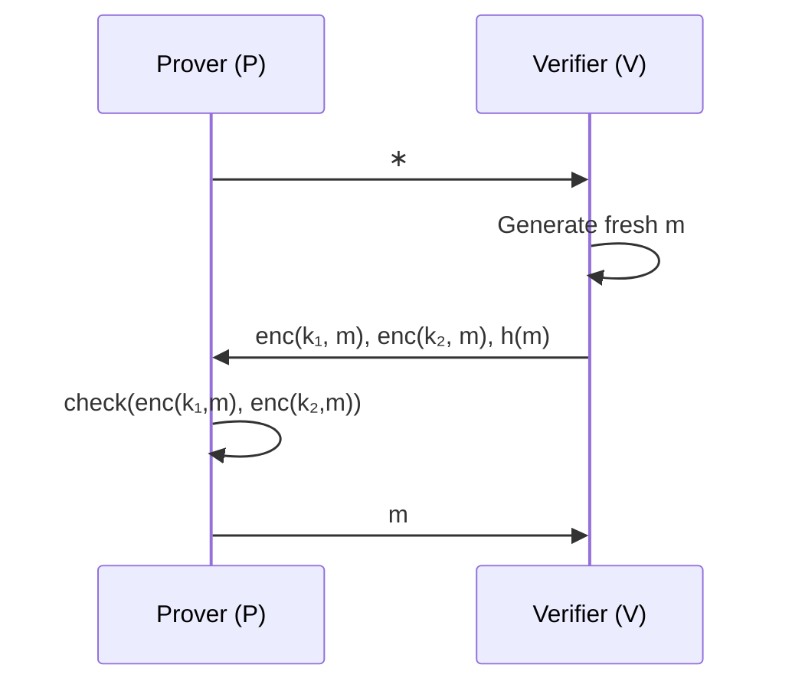

# Can we formally verify privacy properties?

## Motivations

We're interested in finding some stupid bugs in Tornado Cash like applications, Semaphore, Privacy Pools. What if a developer accidentally asks a user to input their deposit index into the Solidity withdrawal function? This is likely if people are vibe coding things. Can we automatically detect this without relying a manual check?

The automation might pay more dividends if we are to design a complicated privacy applications, say the old Unirep.

## Recent advances in formal verification

We can kind of handle completeness and soundness this way. Because it is about reasoning the program inputs and outputs.

github.com/zksecurity/evm-asm/blob/main/EvmAsm/Evm64/Add/Program.lean

https://blog.zksecurity.xyz/posts/clean/

For privacy, we need to reason how information spread between parties. That's where epistemic logic comes in.

## Epistemic approach

Snarks are usually defined in complexity/computational model. "Given poly attacker, the probability of breaking soundness is negaligible"

Epistemic approach models things in more binary approach. "Without learning the private key, I can't break ciphertext."

- Cryptography is assumed perfect. 

### Process

- Decribe the protocol in a math language. Specify what states and state transition this system can have.
- Specify the security goal in this language. Usually specifing the knowledge an agent has. Like attacker shouldn't learn my private key.
- Run the intepreter and tracks the knowledge posessed by attackers and honest parties.
- See if security goal holds in the end.

## What a complete tooling should look like?

[@rajaonaEpistemicModelChecking2024] is a proof of concept of how a full fledged epistemic logic tooling can achieve. Exsiting tooling either have these problems:

- Exsiting tooling can either check attacker-reasoning or Honest-party reasoning, but not both
- Exsiting toolings verify only partial properties. But this paper handles anonymity, unlinkability (weak and strong), whitelist privacy, etc.
- Exsiting toolings verify some properties approximately. False positive exists.

The paper exhibited cases like private auth protocols, where messages are sent to designated targets.

### Performance Note

51 minutes for some Basic-Hash cases, timeouts beyond that

### What failure mode looks like?

### Notes

Note that unlinkability is defined differently. In epistemic model, unlinkability means there's no way to tell which world you are in. 
In Tornado Cash, unlinkability is defined probabilistically. It's unlikely to link people in the anon set, if they do things right.

## Defining ZKPs in Epistemic logic

[@costaDynamicEpistemicVerification] Specifies the security properties for ZKPs.

Broken Key Protocol. V has two keys and one of them is compromised. P has the compromised key and proves it to V without revealing which key is compromised.

### What failure mode looks like?

### What's missing?

The DY attacker. It seems modeling them involves complexities. (Like what?)

## Tornado Cash like situation

What are required?

- DY attacker to see all messages
- Modelling ZK in Epistemic logic
- Dynamism
- Actual tooling to use

### Other concerns

- Complexity explosion. Epistemic method requires tracking knowledges. Few interactions can blow the states to track.
- Public chain nature. In Tornado Cash like applications, messages are boradcasted public. Most of the Epistemic models target private interactions.

## What real Tornado Cash like system hacks look like?

Real world TC like system did stupid bugs, but stupid in a different way.

2026 Feb: Foom and Veil Cash. Skipped trusted setup. [Foom](https://smartcontractshacking.com/hacks/foom-cash-hack-2026), [Veil](https://github.com/DK27ss/VeilCash-5K-PoC)

[bibliography]
